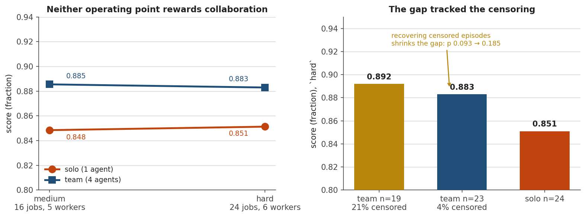
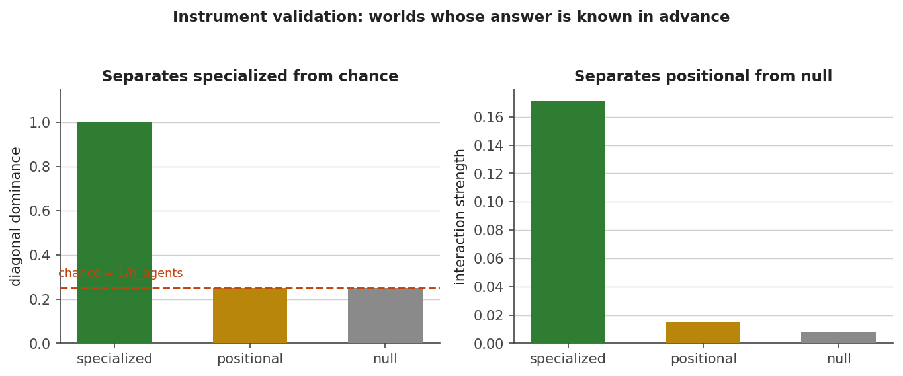

# CollabEngine-LLM

**A framework for giving LLM agents no roles at all, then testing causally whether the division of labour they invent is functionally real.**

Several instances of the *same* open model share a task and a channel. Nobody is told to plan, criticise, or verify. If roles appear, the question is whether they are functionally real or a pattern being read into transcripts — and that is settled by ablation, not by reading.

[Research design and phases](PLAN.md) · [Full engineering and research log](docs/RESEARCH-LOG.md)

---

## The claim under test

> Emergent role differentiation in same-model LLM agent teams is behaviourally observable and statistically stable — but its transcript-derived labels predict causal contribution only weakly.

Either direction of that result is publishable, which is the mark of a well-posed experiment.

**Two things separate this from prior work.**

**Specialisation is a claim about *differential* contribution.** A scalar drop when you remove an agent proves only *participation* — remove any competent contributor from any team and output falls. The real signature is an **agent × task-component interaction**: ablating the emergent "critic" must damage criticism-loaded components more than planning-loaded ones. The analysis double-centres the ablation matrix to strip both main effects and reports what survives.

**One model, many contexts, is the control.** Identical weights across every agent means observed differentiation cannot come from model heterogeneity. Prior observational work on unassigned roles used several different LLMs, leaving that confound open.

---

## Current result: Phase 1 does not clear its own gate


Llama-3.1-8B-Instruct (Q4_K_M, served by llama.cpp) on constraint-satisfaction instances, **24 episodes per arm**, identical instances across arms, both arms from the same run:

| | metric | solo | team | gap | *d* | perm *p* | **gap, cap controlled** |
|---|---|---|---|---|---|---|---|
| **medium** | `fraction` | 0.564 | 0.631 | +0.067 | +0.31 | 0.305 | **−0.023** |
| **hard** | `fraction` | 0.342 | 0.591 | **+0.249** | **+1.09** | **0.000** | **+0.024** |
| **xhard** | `fraction` | 0.310 | 0.499 | **+0.188** | +0.75 | **0.020** | **−0.056** |

**Two of three operating points clear the gate. None survives the control, and two of the three controlled gaps are negative.** That last column is the finding, and it is worth being precise about.

**The two arms do not use `max_tokens` the same way.** A solo episode is three turns and the last one carries the entire answer. A team episode is twelve and the last one commits an answer the transcript already contains. The same per-turn cap therefore lands on solo's answer and on the team's *summary* of one. At `hard`, solo's answer-bearing turn was truncated in 10 of 24 episodes and the team's in 1.

Those 10 episodes are the entire effect:

| `hard` | zeros | malformed | answer turn cut | **non-zero mean** |
|---|---|---|---|---|
| solo | 10 / 23 | 10 | 9 | **0.605** |
| team | 0 / 24 | 0 | 1 | **0.591** |

**When one agent manages to emit a parseable answer, it matches four agents.** Drop answer-turn truncation from both arms and *d* = 1.09 becomes a gap of +0.024 at *p* = 0.64, with `strict` changing sign.



**The artifact grows with instance size, which is the shape the hypothesis predicts.** Harder instances need longer answers, so solo's one answer turn hits the cap more often while the team's summary turn does not. Answer-turn cuts run **7 / 10 / 15** across the three tiers for solo against **0 / 1 / 2** for the team; solo's per-turn truncation reaches 58% at `xhard` against the team's 22%. The controlled gaps show no trend at all: −0.023, +0.024, −0.056.

The preregistered hypothesis was a team advantage growing with instance size. The uncontrolled data show exactly that, significantly, twice. **A difficulty curve read without this control is indistinguishable from the effect it was built to detect.**

The integrity filter that was supposed to catch this caught **1 of the 10** at `hard` — it excludes a malformed episode only when *every* turn was truncated, and solo's last turn is the only one that matters. Worse, at `xhard` it finally engages on 7 solo episodes, which is why the headline gap *falls* from +0.249 to +0.188 while the underlying artifact is at its largest. A partial correction applied unevenly across the independent variable is worse than none: the residual stops being a constant offset.

The generalisable form: **an instrument limit applied identically to both arms is not a fair limit if the arms use the resource differently.**

So the gate still fails, and the reason to believe that is the same reason as before: **every artifact removed has made the gap smaller, never once the other way.** On the bf16 instrument, recovering censored episodes at `hard` moved it +0.040 → +0.032. On the served instrument, controlling the answer-turn cap moved it by −0.090, −0.225 and −0.244 at the three tiers respectively. Six corrections, one direction.

**The honest limit on that last column.** Controlling for answer-turn truncation costs most of the solo arm at the hard end — usable *n* falls 22 → 17 → 9. At `xhard` the controlled comparison rests on nine solo episodes, so −0.056 is a weak estimate and its *p* reflects that. The claim these three rows jointly support is not that the team is *worse*; it is that **no controlled comparison at any operating point shows the team ahead**, and every uncontrolled one that did was tracking a truncation rate that grew with the independent variable. Full accounting in [RESEARCH-LOG §4.9–4.11](docs/RESEARCH-LOG.md).

### The one comparison that survives the control

The gate compares 4 agents × 3 rounds against 1 agent × 3 rounds — which is not a matched comparison. The team spends roughly **2× the output tokens across 4× the forward passes**, so "four agents beat one" has never been separable from "more tokens beat fewer". The `solo_budget` arm gives one agent the team's whole turn budget (1 × 12 rounds, same per-turn cap) to separate them.

| controlled `fraction` | solo, 3 turns | solo_budget, 12 turns | team, 12 turns |
|---|---|---|---|
| **medium** | **0.654** | 0.549 | 0.631 |
| **hard** | 0.561 | 0.526 | **0.585** |
| tokens / episode | ~2,100 | **~8,700** | ~4,800 |
| consecutive turns >80% repeated | 0–4% | **25–33%** | 2–7% |

Two readings that sound contradictory and are not. **Against the cheap three-turn baseline the team is a coin flip at 2.2× the cost** — one tier each way, neither significant. **Against the matched-budget baseline the team wins at both tiers** (+0.082, *p* = 0.039; +0.059, *p* = 0.045), and these are the only positive results in this project to survive the truncation control.

The last row reconciles them: a lone agent driven through twelve turns spends a third of them restating what it just said, and each restatement is another chance to break a constraint it had already satisfied. Team agents repeat 2–7% of the time, because each is responding to something new. **What the multi-agent structure demonstrably buys is protection against single-agent long-horizon degradation, not better reasoning** — and that requires no role specialisation to explain, which is a far narrower claim than the one this project set out to test.

Also note the direction: the team wins while generating *less*. The budget confound does not merely wash out, it reverses.

> **This is exploratory and bounded above.** `solo_budget` was built and run the same day, in response to the measurement that motivated it — it is not preregistered, and [PREREG-xhard](docs/PREREG-xhard.md) says so. It also drives one agent through a protocol built for four, so a purpose-built long-form single-agent baseline would likely close much of the gap. Treat +0.059–0.082 as an upper bound, not an estimate. `xhard` is still generating.

PLAN.md makes this a stop condition, so the ablation grid was not run: an agent × component interaction measured where the team contributes nothing would be measuring the noise floor.

**Phase 2 finds no role differentiation either.** 468 messages coded against an eight-action taxonomy: agents within an episode differ no more in what they do than shuffling the labels among them produces (*p* = 0.45), and no agent identity carries a stable tendency across episodes (*p* = 1.00). The one robust behavioural result is between conditions rather than within teams — **teams generate and lone agents audit**: propose as a share of propose+verify is 0.674 for teams against 0.403 for solo, *p* < 0.0001.

That null survives its own instrument check. The local 8B coder agrees with a much stronger blind rater at **κ = 0.68 [0.50, 0.85]** on a sample deliberately loaded with the rare labels, so the taxonomy collapsing to `propose`/`verify` is a property of these transcripts, not of a cheap judge.

**Three claims were withdrawn along the way** and are documented rather than quietly dropped — a `medium` comparison whose team arm had two thirds of its turns empty, a variance effect present in one team arm but not the other two, and a *d* = 0.92 feasibility result that evaporated when three OOM-dropped episodes were regenerated (the episodes the card could not finish were longer and scored 0/3, so losing them flattered the team). See [RESEARCH-LOG §4.1](docs/RESEARCH-LOG.md).

The variance claim is worth one more line, because it came back. On the served `medium` corpus solo's spread is 0.281 against the team's 0.107 at *p* = 0.040 — the retracted finding, apparently replicated on a new model, a new instrument and equal arms. Controlling for answer-turn truncation returns *p* = 0.430. Solo's excess variance was its four zeros, and its four zeros were the cap.

---

## Install

```bash
pip install -e ".[dev,analysis]"
pytest -q          # 344 tests, seconds, no GPU
```

Python 3.10+. `dev` brings the test suite, `analysis` brings pandas and statsmodels for the mixed-effects test; the module that needs them imports lazily and says so if they are missing.

**No GPU is required for any of the above.** The mock backend runs the whole pipeline end to end, which is what makes the validation below free. Real runs additionally want `torch` with CUDA and `transformers`, deliberately undeclared so a laptop checkout stays small.

## Validate the instrument before trusting it

```bash
collabengine selftest
```



Three worlds whose answer is known in advance — genuinely specialised agents, wholly undifferentiated ones, and agents whose behaviour tracks turn slot rather than identity. Dominance separates the specialised world from the other two but *cannot* separate positional from null, because both put ownership at chance by construction, and chance is `1/n_agents`, not zero. Interaction strength is what distinguishes those two.

A pipeline that reports specialisation in the null world is manufacturing its result. Catching that here costs seconds; catching it after a rented GPU run costs the study.

## Run against a real model

```bash
collabengine pipeline --config configs/local-gpu.yaml --auto-difficulty
collabengine analyze  --config configs/local-gpu.yaml
```

`pipeline` calibrates, picks the operating point, then runs baseline, the symmetry sweep, the fixed-order control and the ablation grid in one process — weights load once, the phases share a work queue so the batcher never drains, and no phase waits on a human to read a table. The individual steps (`calibrate`, `baseline`, `ablate`) still exist on their own. Runs resume, and resume is covered by a test asserting planned and recorded episode ids match, because they once did not and every restart silently re-ran the entire grid.

The whole study fits on one 24 GB card — an RTX 4500 Ada here, serving one model to every agent. Two backends exist: an in-process `transformers` path that supplies its own token-budget batching (vLLM has no supported Windows build), and an OpenAI-compatible client pointed at a local server. **The results above come from the served path**; `configs/vllm-8b.yaml` reaches vLLM on WSL2 or a rented Linux box with only `backend.kind` changed.

**The in-process path cannot run the largest tier, and the reason is not a tuning knob.** A bf16 prefill materialises a logits distribution for every prompt position over a 151,936-entry vocabulary, at 1–1.5 MB per prompt token on top of 15.3 GiB of resident weights; `xhard` prompts start near 5,200 tokens. The tier runs instead against a llama.cpp server holding a 4-bit GGUF, where prefill is chunked into `-ub`-sized micro-batches and logits are materialised only for the sampled position — the vocabulary size stops mattering, which is the actual fix. Weights drop to ~4.6 GiB and the whole difficulty curve moves onto that instrument together, because a curve with one point measured elsewhere measures the instrument. See [`docs/LLAMACPP-SETUP.md`](docs/LLAMACPP-SETUP.md) for the memory arithmetic and [PREREG Amendment 2](docs/PREREG-xhard.md) for what the change costs.

```bash
scripts/serve.sh --detach                                          # llama-server
python scripts/preflight.py --config configs/llamacpp-xhard.yaml   # a minute
scripts/served-run.sh          # all three tiers, preflight-gated, resumable
scripts/budget-run.sh          # the C4 matched-budget arm (costs a team arm each)
python scripts/gate_report.py  # every gate number in this README
```

`preflight` is not a formality. Three corpora in this project were lost to conditions that were true before the first episode ran and detectable in seconds — an undersized slot, a server holding different weights, a card already full. It checks all three in about a minute. It is also where §3.12 lives: its slot check silently did nothing for every served run until the day it was found asking `/v1/props` of a server that serves `/props`.

Preflight is not ceremony. Three corpora here were lost to conditions true before the first episode ran: a context ceiling nothing checked, and — new to a served backend — a server quietly holding weights other than the ones the config names, which breaks the identical-weights control while leaving every score plausible.

### The one performance fact worth knowing up front


**Windows does not raise OOM as allocations approach the card — it pages to host memory over PCIe and keeps reporting 100% GPU utilisation.** The batch-48 collapse above is invisible in `nvidia-smi` and looks exactly like a healthy run; the tells are power draw well under the cap and sustained PCIe traffic under a pure decode workload.

The remedy is a hard cap rather than a better budget. `memory_fraction` calls `set_per_process_memory_fraction`, converting silent paging into an ordinary OOM the batcher recovers from by halving. Tuning `max_batch_tokens` only makes paging less likely — three successive budgets here all looked plausible and all paged. Batches are bounded by **tokens, not request count**, and the budget must include `max_tokens`, since generation extends every sequence in the chunk.

The remaining inefficiency is structural: a chunk runs until its longest member stops, so ~40% of decode steps generate padding for finished sequences. Continuous batching is the fix and the main reason to prefer vLLM (~3–5× here) where a build exists.

> On a shared machine, check *free VRAM* rather than your own processes before starting — `scripts/queue-judge.sh` does this and waits. Two 15 GiB models on one 24 GB card do not fail, they page. ([§3.9](docs/RESEARCH-LOG.md))

### The observational half

```bash
collabengine code     --config configs/local-gpu.yaml --judge self --judge-name local8b
collabengine code     --config configs/local-gpu.yaml --judge gemini --judge-name gemini3 \
                      --judge-model gemini-3-flash-preview --condition baseline --limit 1
collabengine kappa    runs/<name>/codes.local8b.jsonl runs/<name>/codes.gemini3.jsonl
collabengine converge --config configs/local-gpu.yaml --codes runs/<name>/codes.local8b.jsonl
```

PLAN.md specifies a frontier API judge, because a local 7–8B is not a reliable coder. Frontier judges are supported (`--judge anthropic`, `--judge gemini`), and a judge only ever reads finished transcripts — using one to *produce* agent turns would destroy the one-model control the design rests on.

Without a paid key the free tiers do not stretch to a corpus: Gemini's free quota is metered **per day**, at 20 requests per model — fewer than one episode. So the free path codes everything locally (replies are ~8 tokens; batched on the same card it is minutes) and spends the daily frontier quota on a *subsample*, reporting Cohen's κ between the two. That does not make the local judge as good as a paid one; it measures how good it is, which is what κ is for. A value far below the 0.78 of the prior-art paper means Phase 4's correlation is not trustworthy on those labels — a result, not a hidden weakness.

Coding checkpoints per episode and **aborts** after consecutive judge failures rather than continuing, because a dead judge labels every remaining message `other`, and a file of `other` is indistinguishable from real data once written.

---

## What the analysis reports

| Quantity | What it answers |
|---|---|
| **Interaction strength** | RMS of the double-centred drops. Zero when ablation is purely additive — no specialisation, only participation. |
| **Diagonal dominance** | Of all the agents you could remove, does the one the transcript calls a component's owner hurt it most? Scored against chance, `1/n_agents`. |
| **Per-mode drops and fungibility** | `Δ(frozen_replay) − Δ(live)`. Near zero means the contribution was irreplaceable; large means the role was real but anyone could have filled it. |
| **Mixed-effects interaction** | Whether the interaction survives significance testing with episode as a random effect. |

The random effect is not decoration. The same instance is played by the un-ablated team and every ablated variant, so a hard instance drags all its rows down together; treating them as independent shrinks the standard errors and manufactures significance. The test is joint across all interaction coefficients — with four agents and four components there are nine, so scanning for the smallest *p* would find one under 0.05 essentially every time under a true null.

## Three confounds, handled in the design

**Compensation.** Remove an agent and the survivors reorganise to absorb its function, masking the specialisation you are measuring. Ablation runs three ways: `live` (compensation allowed), `frozen_replay` (regenerate surviving turns on the recorded schedule), and `frozen_excise` (delete the messages, re-read the answer, zero model calls).

> **Measured caveat.** Excision was *expected* to give the largest drop, since it blocks compensation entirely. It gives nearly the smallest — ~0.002 against live drops of 0.03–0.23. Agents restate the whole working answer every turn, so a contribution is copied into everyone else's messages as soon as it is made. `ablation.propagation_index()` detects this and decides which frozen mode to trust.

**Position vs. identity.** Roles may attach to turn order rather than agent identity — protocol, not specialisation. Speaking order is reshuffled every round, which drives a purely positional world to chance while leaving identity-bound roles untouched. Under a *fixed* order that same world scores 0.50 against a 0.25 baseline: enough to be mistaken for the real thing.

**Symmetry breaking is the independent variable.** Identical model, prompt and context produce identical output, and nothing can specialise. What breaks the tie — name, seed, private scratchpad — is swept rather than fixed and forgotten. The question is whether *minimal* asymmetry amplifies into stable roles.

> **Caveat under in-process batching.** `generate` samples from one global RNG per batch, so per-agent seeds do not produce independent streams the way vLLM's per-request seeds do. Rows still sample independently, but `name_only` and `name_seed` stop being distinguishable on this backend. Reproducing one episode bit-for-bit needs `max_batch_size: 1`; the analysis is unaffected, since transcripts are re-read rather than regenerated.

---

## Layout

| Path | What |
|---|---|
| `tasks/` | Instance generation (satisfiable by construction), per-component grading, prompt rendering |
| `orchestrator/` | Episode loop, team composition, turn scheduling |
| `backends/` | `mock` (no GPU), `hf_local` (in-process CUDA, token-budget batching), `openai_compat` (vLLM or llama.cpp, with preflight and context-overflow labelling), plus the `anthropic` / `gemini` judges |
| `ablation/` | Live, frozen-replay, frozen-excise, plus capacity and random-message controls |
| `analysis/` | `interaction`, `mixed`, `coding`, `convergent`, `integrity` (instrument failures vs team failures), `scoring` (three metrics, re-scorable offline) |
| `runner/` | Bounded-concurrency execution with resume |
| `transcripts/` | JSONL episode records, sharded for parallel writers |
| `scripts/figures.py` | Regenerates every figure above from the corpus |
| `scripts/preflight.py` | Refuses a served run whose slot is too small or whose server holds the wrong weights, before the night is spent |
| `docs/RESEARCH-LOG.md` | Full record: every failure, pivot and measurement, with what each cost |
| `docs/PREREG-xhard.md` | A preregistered prediction, its two amendments, and why the tier had to change instrument to run at all |
| `docs/LLAMACPP-SETUP.md` | Serving arithmetic: KV per token, the `--parallel` trap, and why `-ub` is the fix |

**Orchestration is hand-written on purpose.** Every mainstream agent framework ships role scaffolding in its prompt templates, which would silently plant the structure this project claims to observe emerging.
