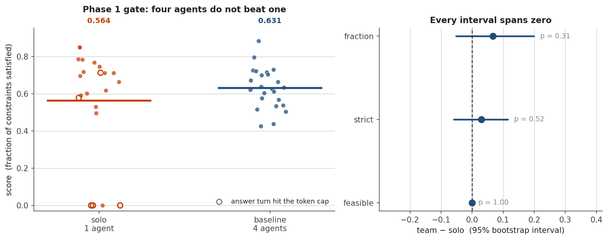
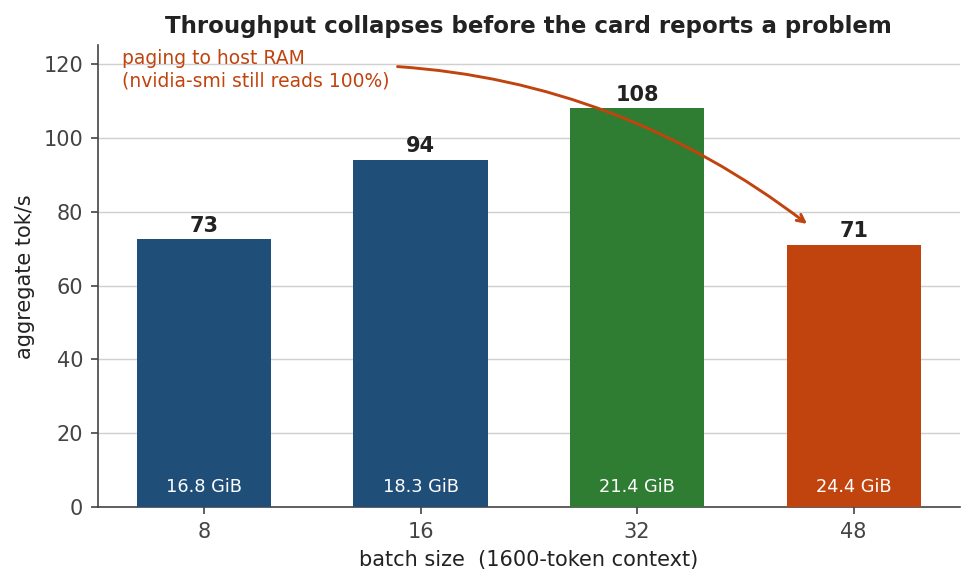

# CollabEngine-LLM — Research and Engineering Log

A complete record of the project to date: what was built, what broke, what each
failure cost, and which findings survive. Written to be usable as raw material
for a paper, so it separates **results** (things measured about agent teams)
from **instrument history** (things learned about measuring them) — and is
explicit about the several occasions where the second was mistaken for the
first.

**Status at time of writing: 2026-08-08 23:00.** 45 commits, 277 passing tests,
one completed Phase 1 measurement, no Phase 3 results yet. A `hard`-difficulty
run is in progress; its solo arm is in and reported in §4.2.

---

## 1. The claim under test

> Emergent role differentiation in same-model LLM agent teams is behaviorally
> observable and statistically stable — but its transcript-derived labels
> predict causal contribution only weakly. Specialization is functionally real
> to the extent that ablating an agent damages *its* task components
> differentially; where that interaction is absent, apparent specialization is
> an artifact of reading structure into text.

### 1.1 The correction that defines the design

The project began from "knock out one agent, measure the performance drop,
prove specialization is real." That is not a test of specialization. A scalar
drop demonstrates **participation** — remove any competent contributor from any
team and output falls, which is equally true of four identical agents with no
division of labor.

Specialization is a claim about **differential** contribution. The causal
signature is an **agent × task-component interaction**: if agent A emerged as
the critic and B as the planner, ablating A must damage criticism-loaded
components *more than* planning-loaded ones, and ablating B the reverse. The
main effect proves nothing; the crossover is the result.

Every downstream design decision follows from this: per-component grading
rather than a scalar score, double-centering to strip main effects, and a
mixed-effects model with episode as a random intercept to test the interaction
term specifically.

### 1.2 Position against prior work

| Work | Roles | Method | Gap |
|---|---|---|---|
| ROMA (2020) and MARL lineage | Emergent | Learned role embeddings | Not LLM agents; roles architectural, not linguistic |
| Behavioral Differentiation Without Role Assignment (2604.00026) | Emergent | Observational only — 208 runs, 13,786 coded messages, κ = 0.78 | **No causal ablation** |
| Agents that Matter (2605.27621) | Pre-assigned | Causal LOO ablation | Ablation used to *optimize*, not to *validate* emergence |

The observational half and the causal half both exist. Nobody has pointed the
causal instrument at the emergent phenomenon. Two external results support the
premise: *Agents that Matter* found introspective LLM judges do **not**
faithfully approximate ablation behaviour (third-party evidence that
transcript-reading ≠ causal reality), and *Behavioral Differentiation* found
teams "spontaneously exhibit compensatory response patterns when an agent
crashes" (simultaneously encouraging and the largest threat to the design).

**Second novelty axis:** 2604.00026 used seven *different* LLMs, so their
differentiation is partly confounded with model identity. Using one model for
every agent makes identical weights a control — observed differentiation cannot
come from model heterogeneity.

### 1.3 The three confounds, addressed in design

- **C1 Compensation.** Survivors reorganize and absorb a removed agent's
  function, so a small drop is ambiguous between "did nothing" and "was real but
  fungible." Handled by running three ablation modes and treating their
  *differences* as the result. `Δ(frozen_replay) − Δ(live)` is the fungibility
  metric.
- **C2 Position vs identity.** Agent 1 may "plan" only because it speaks first —
  that is protocol, not specialization. Handled by randomizing speaking order
  per episode and per turn, plus a `fixed_order` control condition.
- **C3 Symmetry breaking as the independent variable.** Identical model, prompt
  and context produce identical outputs; something must break symmetry. Made a
  swept parameter (name-only → name+seed → name+seed+scratchpad) rather than an
  implementation detail.

---

## 2. Chronology

### 2.1 Day 1 (2026-08-07, 17:48 – 20:05) — scaffold on the assumption of no GPU

Eight commits built the whole pipeline against a mock backend: task generator
with tagged constraint classes, per-component grader, prompt rendering and
answer parsing, orchestrator, transcript store, ablation modes with controls,
the propagation diagnostic, an OpenAI-compatible backend, a parallel runner, and
the CLI/config system.

This was done under the belief that the machine was an i3-5005U with 7.9 GB RAM
and no CUDA device, which is what PLAN.md §1 stated. That belief shaped the
architecture productively — it forced a backend abstraction, a mock capable of
exercising the full pipeline for free, and resumable runs. All three were worth
keeping once the belief turned out to be false.

### 2.2 Day 2 (2026-08-08) — the GPU day

| Time | Event |
|---|---|
| 07:32 | Hardware corrected: RTX 4500 Ada 24 GB, CUDA available. Python floor lowered to 3.10 |
| 07:38 | `hf_local` CUDA backend added — the enabler for every GPU phase |
| 07:58 | Phase 2–4 analysis added; **resume bug found and fixed** |
| 08:01 | Batches bounded by tokens rather than request count |
| 08:23 | Gemini judge added after the judge-availability pivot |
| 09:36 | Phase 1 gate folded into the run as a paired solo condition |
| 09:41 | **Ablation reference pollution fixed** |
| 12:26 | Batch budget reset from measurement (first, wrong, measurement) |
| 17:11 | **Integrity filter added** — token cap was writing zeros into the grid |
| 17:45 | Mid-stage throughput heartbeat added |
| 18:17 | Production-shape benchmark; allocator exonerated |
| 19:17 | **OOM recovery fixed** — retry inside `except` can never free memory |
| 21:42 | **Operating point moved to `hard`** — Phase 1 gate failed at `medium` |

---

## 3. Failures, in detail

Ordered by how much they mattered. Every one of the first four produced
**plausible wrong data rather than an error**, which is the thread connecting
them and the main methodological lesson of the project so far.

### 3.1 The token cap was writing zeros into the ablation grid

**Symptom.** In the first real corpus, 3 of 12 solo episodes scored exactly
0.0 with `detail: {malformed: true}`.

**Diagnosis.** `finish_reason: "length"` on every turn of those episodes.
Agents spent all 512 tokens walking 16 jobs through 29 constraints and were cut
off before emitting the `<answer>` JSON block. Across the corpus, **72% of all
agent turns (26/36) hit the cap**; mean completion was 424 of 512 tokens.

**Why it was dangerous rather than merely wasteful.** A malformed episode grades
0.0 on every component, which is indistinguishable in the means from a team that
answered badly. Left in, it biases in both directions at once: it deflates the
baseline reference (understating every drop) and inflates whichever ablation
cell it lands in (overstating that one). Worse, **truncation is not random with
respect to the phenomenon under study** — a turn is cut off when its author
writes a lot, and how much each agent writes is precisely the emergent behaviour
being measured. That manufactures an agent × component interaction out of the
token budget: a false positive in the exact direction the study cannot afford.

**Fix.** `max_tokens` 512 → 1024, plus `analysis/integrity.py`, which classifies
an episode as an instrument failure rather than a result. The rule is
deliberately narrow — malformed **and** every agent turn truncated, meaning no
turn ever had the opportunity to finish. A malformed answer after a turn that
ended on its own is a genuine refusal to commit and stays in the means.
`analyze` prints the per-condition table before any number that depends on it,
so the filter is never silent.

**Effect of the fix.** Truncation 72% → 28%, mean completion 424 → 627 tokens,
malformed 3/12 → 0/12.

**Cost.** Roughly two hours of GPU time spent generating a corpus that had to be
archived.

### 3.2 The calibration measured the token cap and reported it as a difficulty

**Symptom.** With the cap fixed, solo score at `medium` jumped from 0.55 to
0.879.

**Diagnosis.** `calibrate` had chosen `medium` as the operating point while
`max_tokens` was 512. Truncation was suppressing solo performance, which made
medium look correctly pitched. Fixing the cap raised the scores and invalidated
the difficulty choice in the same stroke — **one bug, two casualties, the second
visible only after fixing the first**.

**Consequence.** See §4.1 — the Phase 1 gate fails at `medium`. Had this not
been caught, roughly six hours of ablation grid would have run at an operating
point where the team contributes nothing, producing small drops against a
baseline the extra agents were not lifting, and those drops would have looked
like results.

**Generalisable lesson, and the one most worth putting in the paper.** *A
calibration is only as trustworthy as the instrument settings in force when it
ran, and nothing in its output records what those were.* This is why `analyze`
now prints `finish_reason` accounting ahead of every dependent number.

### 3.3 CUDA OOM recovery could never work

**Symptom.** After adding a hard memory cap, a stage wrote 12 episodes in four
minutes — every turn `finish_reason: "error"`, zero tokens, all graded 0.0.

**Diagnosis.** The halving retry lived *inside* `except
torch.cuda.OutOfMemoryError`. While an except block runs, the active exception's
traceback holds every frame inside `generate()` — including the KV cache that
just failed to fit. `torch.cuda.empty_cache()` therefore reclaims nothing, each
halved retry starts from a still-full allocator and OOMs in turn, all the way
down to a single sequence. One oversized batch became an entire stage of empty
turns.

**The bug was always present**; paging (§3.4) had been masking it by absorbing
oversized batches into host memory instead of failing.

**Fix.** Set a flag in the handler, recover after the block exits, where `del`
and `empty_cache()` do what they say. The integrity filter was extended: an
errored turn condemns its episode on its own — unlike truncation there is no
reading under which it says anything about the agent whose turn it was — and it
counts even if the surviving turns still produced a parseable answer, because
the episode then describes a team missing a member it should have had.

### 3.4 Windows pages to host RAM instead of raising OOM

**The single most expensive failure of the project.**

**Symptom.** Runs at 100% GPU utilization, no errors, producing almost nothing.
One stage ran 4 hours and completed zero episodes.

**Why it resisted diagnosis for most of a day.** Every surface that normally
signals trouble looks healthy:

| Signal | Paging | Healthy |
|---|---|---|
| GPU utilization | 100% | 98–99% |
| Errors | none | none |
| Peak allocated bytes | plausible | plausible |
| **Power draw** | **62–64 W** of 210 | **155–176 W** |
| **PCIe traffic** | **18,000 / 12,600 MB/s** | **50–80 / 15–32 MB/s** |

The WDDM driver does not refuse an allocation that no longer fits; it migrates
the working set to host memory over PCIe and the run continues several times
slower. `nvidia-smi dmon -s t` is the only readily available surface that
distinguishes the two states. **Sustained multi-GB/s under a pure decode
workload means the budget is too high, whatever the peak allocation says.**

**Fix.** `torch.cuda.set_per_process_memory_fraction(0.90)`. This makes paging
*impossible* rather than merely unlikely: the allocation fails first, and a
failure is an ordinary OOM the batcher recovers from. Tuning the token budget
only ever changes the probability — three successive budgets (44000, 40000,
30000) all looked defensible and all paged.

**Cost.** Approximately six hours of GPU time across several runs, plus one run
killed roughly 30 minutes before it would have written its episodes.

### 3.5 Resume was broken for the entire ablation grid

**Symptom.** Restarts silently re-ran work already on disk.

**Diagnosis.** Planned episode ids (`live:A1:0`) did not match recorded ids
(`live:A1:tiny:0`), so no plan was ever skipped. No error — just hours of
repeated card time.

**Fix.** `_run_id` / `_derived_id` helpers, plus a test asserting that the set of
planned ids equals the set of recorded ids across every mode. That test is the
thing that keeps it fixed.

### 3.6 The ablation reference was polluted by non-baseline episodes

**Symptom.** Found by inspection, not by failure.

**Diagnosis.** Stage 1 writes baseline, solo, symmetry and fixed-order episodes
to one transcript. `_component_means` averaged across all of them, folding a
one-agent team's score into the reference that four-agent ablations are measured
against — shrinking every drop toward zero and, where solo scored low enough,
past it.

**Fix.** Condition filter defaulting to `baseline`, plus a test asserting that
filtered and unfiltered means differ.

### 3.8 One chunk's failure blanked the whole batch — the corpus-costing bug

**Symptom.** A gate check reported 24 of 36 episodes as instrument failures.
Every four-agent episode in the corpus was affected.

**Diagnosis.** `RuntimeError: CUDA OOM generating a single sequence` on **96 of
144** agent turns. A batch is split into chunks by token budget, each run as its
own forward pass. When one chunk raised, the exception escaped
`_generate_batch`, and the queue worker's handler failed the *entire group* — so
one round-three context too long to fit blanked every turn batched alongside it,
including turns that had already generated successfully.

**Why it was expensive rather than merely annoying.** An errored turn produces
an empty message and the episode still completes, still parses an answer from
whatever turns survived, and still receives a plausible score. Nothing crashed.
The corpus looked finished. Its headline number (§4.1) was published before
anyone asked how many turns were in it.

**Fix.** Chunks are isolated — a failure produces error responses for that chunk
only. A single sequence that cannot fit returns an error rather than raising,
for the same reason. `_release()` now reclaims between chunks: Python frees the
tensors when a frame returns, but the caching allocator keeps the blocks and
`set_per_process_memory_fraction` counts what is *reserved*, so a stage drifts
into OOM over time with nothing actually leaking. That drift is the likely
reason single sequences were failing at all, since one 6000-token sequence needs
under a gigabyte of KV against several free.

**A near-miss worth recording.** The `_release` helper was initially added by a
string replacement that silently matched nothing. All 283 tests still passed,
because the fake backend used in tests overrides the method that calls it — the
real run would have hit `NameError` on its first chunked batch. It was caught
only because a test was written that imported the helper directly. This is the
same shape as the length-sorting test in §3.7: **a test that exercises a fake
cannot tell you the real path exists.**

### 3.7 Smaller failures

| Failure | Consequence | Fix |
|---|---|---|
| `model.generate(generator=...)` unsupported | — | `transformers.set_seed` before each batch |
| `set_seed` rejects ≥ 2³² | Crash | Hash batch seeds mod 2³²−1 |
| asyncio queue bound to first event loop | Crash on reuse | Track loop, rebuild queue on change |
| Heartbeat divided by previous pass's tokens | Rate read 17→26→29 for a run steady at 31 | Count tokens before reporting |
| Followup matched `python.exe` by name | Judge could start while card busy | Match command line |
| Six stale followup processes accumulated | Six 16 GiB judge loads on completion | Kill and re-arm exactly one |
| `grep` pipe block-buffering | Hid background output repeatedly | Write to files, `python -u` |
| Qwen3 `<think>` block | Would consume the whole turn budget | `enable_thinking=False` |
| Test didn't exercise length-sorting (FakeHF overrode the method) | False confidence | Extract `_sorted_chunks`, test directly |

### 3.9 The card is shared, and the guard that knew it failed open

2026-08-09, 10:03. Phase 2 behavioural coding was launched onto what looked
like an idle card. It was not idle: a *different account on the same
workstation* (`Student2`) had started an unrelated Qwen3-VL job twenty seconds
earlier — `profile_e8_efficiency.py`, a parent plus eight worker processes,
holding 17.3 GiB of the 24 GB and writing to a `FINAL/` results directory under
`--resume`.

Qwen3-8B in bf16 needs 15.3 GiB for weights alone. The two do not fit. Nothing
raised an error, because this is §3.4 again: WDDM paged the working set to host
RAM over PCIe. `nvidia-smi` read 100% utilisation and 24,118 MiB in use, which
is what a card doing useful work looks like. The tells were the ones §3.4
already identified — 60 W of a 210 W budget, and `dmon -s put` showing a
sustained 8 GB/s in and 11 GB/s out with the memory controller at 0%.

**Why it is worth a section of its own.** §3.4 was diagnosed as *our own*
second model colliding with the pipeline, and the fix was written to match that
diagnosis: `followup.sh` waits for our pipeline process to disappear. That
guard is correct and would have passed here, because our pipeline had exited at
09:36. The mental model — "the danger is two of our jobs overlapping" — was one
special case of "the danger is 15.3 GiB not fitting in what's left", and the
narrower model had been encoded into the tooling as though it were the general
one.

`scripts/queue-judge.sh` replaces the process check with a free-VRAM check:
≥18 GiB, stable across three 60-second samples, naming the compute PIDs that
hold the card while it waits.

The three-sample requirement was carried over from `followup.sh`'s `GONE_LIMIT`
as a precaution and was vindicated within the hour. At 12:43:27 the card read
24,288 MiB free — the foreign job had finished a stage — and sixty seconds
later a new process of theirs held it again:

```
[12:43:27] free 24288 MiB (1/3)
[12:44:27] card reclaimed; restarting the count
[12:44:27] free 7237 MiB, need 18000; compute pids: ...,17004
```

A single-sample gate, or a two-sample one, would have started a 15.3 GiB model
into that gap. **"Free right now" and "free" are different measurements when
the resource is contended**, and the difference is one poll interval wide. It **waits rather than kills**. The foreign job is
mid-grid with `--resume` and is not ours to stop, and this is worth stating
explicitly in a log that otherwise treats the GPU as a private resource.

**The guard's first version failed open.** `nvidia-smi` emits CRLF on Windows;
a trailing CR survives `tr -d ' '` invisibly; `$(( 24570 - 17348<CR> ))` is an
arithmetic syntax error; `$free` was left unset; the loop fell through and
started the judge into the busy card at 10:09:39 — the precise outcome the
guard existed to prevent, thirty seconds after the guard was written. Fixed by
stripping CR, validating both figures are digits, and treating anything
unparseable as *busy*.

The general form is worth keeping: **a guard that fails open is worse than no
guard, because it gets trusted.** Without it the card would have been checked
by hand. With it, the check was delegated to nine lines of shell that returned
"clear" on a parse error. This is the same shape as §3.8 (an errored turn
grading 0.0) and the retraction in §4.1 (a filter that was bypassed): in each
case the failure produced a *plausible permissive value* rather than a stop.

### 3.10 A third corpus lost to the same cause, and the fix that should have come first

The first `xhard` run reported `24 done, 0 failed` and was worthless. That
count is episodes that *completed*, not turns that generated:

```
finish_reason: {'stop': 44, 'length': 46, 'error': 90}

condition   eps  unusable   trunc
baseline     12        12     19%     <- the entire team arm
solo         12         7     53%
```

**19 of 24 episodes unusable, 90 of 180 agent turns errored.** The same shape as
the retracted corpus in §4.1, five months of lessons later.

The OOMs began at **5223-token prefills**, on a card that had run 10,661-token
prefills at `hard` under an identical `memory_fraction`. Throughput fell from 24
to 9 tok/s across the run.

**My first diagnosis was wrong, and I acted on it before testing it.** The
shared card (§3.9) had corrupted two corpora already, the symptom matched, and
I concluded the other account had reclaimed the GPU mid-run. I then built a
retry-with-backoff on that assumption, committed it, wrote it up here as fact,
and relaunched. The relaunch OOMed at the same 5223 tokens **with the card
empty** — 2% utilisation, 16 GB held by our own process, no other job. The
evidence that refuted it took one screenshot of Task Manager.

**The real cause, measured directly.** Loading the model exactly as the run
does and walking prefill sizes up:

| prefill | allocation attempted |
|---|---|
| 1 × 5,223 tok | 834 MiB *on top of 22.37 GiB already held* |
| 1 × 8,000 tok | **7.63 GiB** |
| 1 × 12,000 tok | **17.17 GiB** |
| 3 × 5,223 tok | 9.76 GiB |

The failing allocation scales with **prompt tokens**, at roughly 1–1.5 MB each,
and is independent of batch size — 3 × 5,223 and 1 × 12,000 fail alike. That is
the logits tensor: Qwen3's vocabulary is 151,936, and the prefill forward
materialises a distribution for *every* position, upcast, plus a copy. The KV
cache — the thing every memory knob in this project tunes, and the thing three
sections of this log reason about — was never the constraint.

`logits_to_keep=1` does not help: passed to `generate` **or** directly to
`forward`, the attempted allocations are byte-identical. There is no fix from
our side of the API.

**Consequence: `xhard` is not runnable on this card at bf16.** Its prompts
*start* near 5,200 tokens, which is already past the ceiling with 15.3 GiB of
weights resident. Not a tuning problem — `max_batch_tokens`, `max_batch_size`
and `max_model_len` all leave the per-token cost untouched. The tier needs
quantised weights (which would confound the difficulty curve it exists to
extend) or a larger card. *Superseded by §3.11: the confound is real, and the
answer is to move all three points rather than one.*

**Why `hard` and `medium` were fine.** Their briefs render at 1704 tokens
against `xhard`'s 2520. The whole tier sat on the far side of a cliff that the
two measured operating points sit comfortably below — which is also why nothing
before it exposed the bug.

**The retry stays, with its justification corrected.** It is a reasonable safety
net for genuine contention, which does happen here, and it costs only time. But
it did not address this failure and was never going to: against a hard ceiling
it burns two minutes per turn and then records the error anyway, which is
exactly what it did while the card sat at 2% for several minutes. `oom_retries`
is lowered accordingly.

**The lesson is not about memory.** It is that a diagnosis matching a familiar
pattern is not a tested diagnosis. Contention was real, recent, and had caused
this exact symptom twice — which made it the most available explanation and the
one least likely to be checked. The check cost one command.

**The test drives the real `_generate_batch`.** Every other test in
`test_hf_local.py` goes through `FakeHF`, which overrides that method — the
subclass exists to avoid touching CUDA. An earlier OOM fix passed all 283 tests
while doing nothing for exactly that reason (§3.3), so this one stubs the
tokenizer and model and drives the real code path, asserting the backoff
schedule and that the recorded error says retries were spent.

### 3.11 Stop tuning around the ceiling; serve the model instead

*Written before any episode was generated on the new instrument. No result below
this line — this section records a decision and its cost, not a finding.*

§3.10 ends with two options for `xhard`, quantised weights or a larger card, and
dismisses the first in a parenthesis: it "would confound the difficulty curve it
exists to extend". That parenthesis was right about the confound and wrong about
what follows from it. A confound you can measure is not a reason to abandon a
test; it is a reason to measure it. The curve is confounded only if one point is
moved. Moving all three costs card time and nothing else.

**The change.** Meta-Llama-3.1-8B-Instruct at Q4_K_M, served by llama.cpp over
the existing `openai_compat` backend, replacing Qwen3-8B at bf16 loaded
in-process. All three tiers regenerate; the Qwen3 curve is superseded, not
extended. Registered as Amendment 2 to `docs/PREREG-xhard.md` before any episode
ran, along with the two confounds it introduces and the direction each biases.

**Why this removes the failure rather than tuning around it.** The failing
allocation in §3.10 was the prefill logits tensor: every prompt position, over a
151,936-entry vocabulary, upcast, plus a copy. Three things change at once, and
only the third is decisive.

| | in-process bf16 | served Q4_K_M |
|---|---|---|
| weights resident | 15.3 GiB | ~4.6 GiB |
| prefill | whole prompt in one forward | micro-batches of `-ub` tokens |
| prefill logits | every position | the sampled position only |

Freeing 10 GiB by quantising would have bought roughly 7,000 more prompt tokens
against a cost of 1–1.5 MB each — enough for `xhard`, and still the same cliff
one tier further on. Chunked prefill removes the term instead of shrinking its
coefficient: the activation peak of a 15k-token prompt becomes the peak of a
512-token one, and the logits are never materialised for the other 14,848
positions. The vocabulary size stops mattering, which is why this is the fix and
the quantisation is the enabler.

**Two things the pivot buys that were not the point.**

*A slot size that does not vary along the curve.* The bf16 configs could not
manage it — `xhard` needed `max_model_len` 18432 where `hard` ran at 12288 — so
the three points differed in the instrument as well as the instance. The served
configs hold 17408 across all three.

*Overflow that announces itself.* A served backend cannot silently left-truncate
the way §3.x's tokenizer did; a prompt that does not fit comes back as an HTTP
error. The backend now labels it `context_overflow` and does not retry, because
unlike an OOM it is deterministic in the prompt and the preregistration's
regenerate-don't-drop rule would otherwise loop forever against it.

**Two new ways to lose a corpus, and what checks them.** Neither is hypothetical:
both are the served forms of failures already in this log.

1. *The slot is smaller than it looks.* llama.cpp divides `-c` across
   `--parallel` slots, so raising concurrency to fill the card shrinks every
   window. At `--parallel 24` — the concurrency the bf16 configs used — a
   73,728-token context gives each request 3,072 tokens, and every team turn is
   rejected. `max_concurrency` is 4 in all three configs for this reason, and it
   matches `--parallel` exactly: an episode issues one request at a time, so
   episodes in flight *are* concurrent requests.
2. *The server holds different weights than the config names.* The
   identical-weights control was enforced by nothing but the launch command.
   `preflight` now compares the served model id against the config.

`scripts/preflight.py` runs both checks plus a live request at the worst-case
size, in about a minute, before any stage starts. Three corpora in this project
were lost to conditions that were true before the first episode ran and
detectable in seconds. That is the whole argument for it.

### 3.12 The preflight guard was open, and said so in the server's voice

§3.11 ends by arguing that `scripts/preflight.py` is worth its minute because
"three corpora in this project were lost to conditions that were true before the
first episode ran and detectable in seconds". The slot check it names first had
never run.

`/props` is served at the llama-server **root**. Preflight requested it through
the `openai_compat` client, whose `base_url` ends in `/v1`, so it asked for
`/v1/props` — which llama-server answers 404, while serving `/props` 200. The
404 was read as absence, and absence is deliberately not a failure there (vLLM
has no `/props` at all), so the check degraded to a note and the run proceeded:

    note: no /props; slot size unverified (vLLM, or an older llama.cpp).

Every clause of that note is wrong about this server. It was neither vLLM nor
old; it was answering the endpoint at the address nobody asked. Measured on the
running build: `models` is served at both `/models` and `/v1/models`, `props` at
the root only. That asymmetry is the entire habitat of the bug — the request
that verified the model worked under either spelling, so nothing upstream of the
slot check ever looked wrong.

**Why the suite was green.** The stub matched `request.url.path.endswith("/props")`,
which answers `/v1/props` as readily as `/props`. A test double laxer than the
thing it doubles cannot fail on the difference between them, and this one was
laxer in precisely the dimension the code got wrong. The stub now matches paths
exactly and mirrors the measured asymmetry, and a regression test asserts the
URL preflight actually requests.

**What it cost, and what it did not.** Nothing in §4 is affected: the live probe
runs after the slot check and accepted 17,381 prompt tokens on the real server,
so the geometry was confirmed — by the slower check, for the whole time the fast
one was silent. The exposure was the `--skip-probe` path, and the case where the
probe's estimate happens to fall under a slot that later turns out too small.

With the fix, preflight prints `ctx per slot 18432 (need 18432)`. That is also
the first time the margin has been legible: **zero**. The requirement is
`max_model_len + max_tokens` = 17408 + 1024, and the slot is 18432 exactly. It
fits, and any increase to either cap on any tier fails immediately rather than
partially — which is the good direction for this failure to run, and was not
visible while the number was never printed.

*The generalisable form, which this log now has three instances of (§3.9's
`queue-judge.sh`, §3.10's OOM diagnosis, this): a guard that cannot perform its
check should be much louder than one that performs it and passes. All three
failed open while emitting text that made the silence sound explained.*

### 3.13 Killing the server without stopping the client wrote 137 errored turns

Self-inflicted, on 2026-08-12 at 22:20, and it belongs here because the recovery
depended on machinery §3.6 and §4.1 already paid for.

The answer-budget run was thrashing against a foreign process holding most of the
card (§3.4's failure mode, diagnosed in the commit that armed
`scripts/resume-when-free.sh`). I stopped our `llama-server` to resize it — and
believed I had stopped the pipeline first. I had not. `pkill -f` matched nothing,
because under MSYS `ps -W` prints the **MSYS pid first and the Windows pid
fourth**, and every signal I sent went to a pid that Windows does not know. The
pipeline kept running for four more minutes against a server that no longer
existed.

It behaved exactly as designed, which is the problem. Each turn's request failed,
the backend recorded `finish_reason: "error"`, the orchestrator wrote the episode,
and the runner counted it *done, 0 failed* — because from the runner's side
nothing failed: every episode it planned came back. **137 errored turns across 22
episodes were written to the corpus as data.**

Three things caught it, in the order they fire:

1. `finish_reasons` showed `error: 137` beside `stop: 141` — the accounting §3.2
   added after the token cap wrote zeros nobody could see.
2. `is_instrument_failure` marked all 22 unusable, because a single errored turn
   condemns an episode (§4.1's rule).
3. The audit printed `unusable` above the means, so no number could be read
   without the damage attached.

**What made it dangerous rather than merely ugly.** Resume skips any episode id
already on disk. The 22 broken episodes would have been skipped forever — present,
excluded from every mean, and never regenerated. The corpus would have silently
capped at 74 usable episodes out of 96 with nothing on screen to say why. That is
the precise hazard `scripts/repair.py` exists for and the reason its dry run was
worth building: **an instrument failure left on disk is not a gap, it is a
permanent hole.**

Recovery: back the file up, drop every record `is_instrument_failure` rejects, and
let resume replan the ids that vanished. Filtering re-reads the raw JSONL lines
rather than rewriting from parsed records — a corpus should only ever be truncated
in place, never round-tripped through the serialiser, or the surviving episodes
quietly become a different encoding of themselves. 11 episodes survived, all
`baseline`, all clean.

*The generalisable form: stop the client before the server, and check the pid the
operating system uses rather than the one your shell prints.* The second half cost
four minutes of corpus, and would have cost the run.

*A useful accident.* The 11 survivors are the first episodes generated under
`answer_max_tokens`, and they confirm it works end to end: 121 agent turns
recorded a cap of 1,024, the 11 final turns recorded 3,072, `answer_turn` is true
on exactly one turn per episode, and **none of the 11 was truncated on its answer
turn** — against 0/24 for the team arm and 7/24 for solo on the shared-cap
instrument. Too few episodes to be a result; enough to show the fix is live.

---

## 4. Results

### 4.1 Phase 1 gate at `medium` — **RETRACTED, the team arm was not a team**

> **This result was reported and is withdrawn.** The numbers below were computed
> from 12 four-agent episodes in which **96 of 144 agent turns failed to
> generate** — `RuntimeError: CUDA OOM generating a single sequence`. Two thirds
> of the team never spoke. What was measured was not a four-agent team scoring
> 0.905; it was one or two agents with most turns empty, and the flat gap has an
> obvious alternative explanation that has nothing to do with difficulty.
>
> | condition | n | mean | sd | |
> |---|---|---|---|---|
> | baseline (nominally 4 agents) | 12 | 0.905 | 0.095 | **96/144 turns errored** |
> | solo (1 agent) | 12 | 0.879 | 0.100 | 0/36 errored |
>
> The failure is §3.8: one chunk of a batch raising took down every turn batched
> alongside it. An empty turn grades 0.0, which is indistinguishable in the means
> from a team that answered badly.
>
> **`analysis/integrity.py` caught this correctly** — it flagged all 24
> four-agent episodes as instrument failures. The number was published anyway
> because it was computed with an ad-hoc script that filtered only on
> `malformed`, before the filter was extended to cover errored turns. The lesson
> is not that the filter was missing; it is that *a result computed outside the
> pipeline's own validity checks is not a result*.
>
> **Consequences.** The decision to abandon `medium` for `hard` rests on this
> retracted comparison and is therefore unsupported. The solo arm (0.879, clean)
> stands. Whether `medium` actually fails the gate is **unknown** and needs 12
> uncorrupted four-agent episodes to answer — cheap to obtain, since the solo
> arm does not need regenerating.

### 4.1b Phase 1 gate at `hard` — **fails**

The first valid team-vs-solo measurement the project has produced. Qwen3-8B,
`hard`, `max_tokens` 1024, `max_model_len` 12288, `memory_fraction` 0.95 —
the first configuration in which a four-agent episode survives round three
intact.



*Left: every usable episode, four arms, `fraction` metric. Right: the team−solo
gap under each metric with its 95% bootstrap interval. Regenerate with
`python scripts/figures.py`.*

The measurement was taken twice. The first pass ran on 9 team episodes because
three had died on long-context OOM; since that failure mode selects for long
transcripts and only team transcripts get long, the surviving nine were a
suspect subset. The tainted episodes were regenerated at `memory_fraction`
0.95 before the numbers below were recomputed. **Both readings are kept here
— the difference between them is the finding.**

| metric | solo (n=12) | team, n=9 (first pass) | team, n=11 (regenerated) |
|---|---|---|---|
| `fraction` | 0.842 | 0.862 (*d* +0.31) | 0.871 (*d* +0.40) |
| `strict` | 0.490 | 0.508 (*d* +0.09) | 0.529 (*d* +0.17) |
| `feasible` | 0.083 | 0.000 (*d* −0.43) | 0.091 (*d* +0.03) |

The gate verdict is unchanged, but **one claim from the first pass is
withdrawn.** It read "on the strictest reading the team is *worse* — no team
episode produced a fully feasible schedule, while one solo episode did." That
was subset bias, exactly of the kind predicted: with the two long episodes
restored, one of them *is* feasible, and `feasible` moves from −0.083 to
+0.008. A one-episode gap in a 12-episode arm was never an effect, and the
episode was missing because it was long.

Significance, computed on the regenerated arms (10,000-permutation null on the
arm labels, BCa bootstrap for the interval):

| metric | gap | perm *p* | 95% CI of the gap |
|---|---|---|---|
| `fraction` | +0.029 | 0.373 | [−0.029, +0.088] |
| `strict` | +0.039 | 0.706 | [−0.151, +0.226] |
| `feasible` | +0.008 | 1.000 | [−0.250, +0.273] |

Every interval spans zero. Four agents over three rounds do not measurably beat
one agent on any metric.

Other arms, same corpus: `symmetry:name_seed_scratch` 0.851 (n=12),
`fixed_order` 0.854 (n=10). Both sit within a hundredth of solo. An earlier
note here read `fixed_order` at 0.784 and wondered aloud whether randomised
turn order helps; that was n=4 and it evaporated at n=10.

**A variance result, tested and withdrawn.** The regenerated baseline arm has
roughly a third of solo's variance (sd 0.050 vs 0.095, ratio 3.6, permutation
*p* = 0.019 one-sided) — teams scoring no higher but more consistently is a
plausible mechanism and would have been the one positive result of Phase 1. It
does not survive the other two team arms. `fixed_order` (sd 0.100) and
`symmetry` (sd 0.093) are four-agent teams too, and both are as variable as
solo; pooling all 33 team episodes against solo gives a variance ratio of 1.36
at *p* = 0.21. One arm in three is a fluke, and the direction was chosen after
seeing the data. Recorded because the near-miss is instructive: the arm with
the tight spread is also the arm that lost an episode to OOM, and OOM removes
the tail.

**Two caveats remain.** `feasible` is one episode in each arm, so its CI is an
artefact of a binary outcome at n≈11, not a measurement. And at this n only a
very large effect could reach significance; the design cannot distinguish "no
benefit" from "a benefit too small to see here".

**What it does establish.** Across both difficulties, a 50% increase in
instance size moved a single agent from 0.879 to 0.842 and moved the team
nowhere. The task does not reward collaboration at this model scale, which is
the Phase 1 stop condition, and the ablation grid was not run. An
agent × component interaction measured where the team contributes nothing would
be measuring the noise floor.

Phase 2 remains open and worth running on this corpus: **behavioural
differentiation does not require a performance benefit.** Agents may divide
labour visibly while the division buys nothing, and that combination —
observable roles, no causal contribution — is the strongest form of the
project's original thesis rather than a null result.

#### 4.1c The withdrawn `medium` write-up, kept verbatim

What follows is the text §4.1 carried before the retraction, left in place
because how a wrong result reads while you believe it is part of the record.
Every number in it is contaminated by §3.8. **Do not cite it.**

> Qwen3-8B, 12 episodes per condition, identical instances, `max_tokens: 1024`:
>
> | condition | n | mean | sd |
> |---|---|---|---|
> | baseline (4 agents × 3 rounds) | 12 | 0.905 | 0.095 |
> | solo (1 agent × 3 rounds) | 12 | 0.879 | 0.100 |
> | symmetry: name_seed_scratch | 10 | 0.851 | 0.098 |
>
> **Team − solo gap: +0.026, against a standard error of ~0.029.**
> Indistinguishable from zero.
>
> PLAN.md Phase 1 makes this a stop condition: *"find the band where the task is
> hard enough to need collaboration but not so hard the model floors out. If
> there is no such band, stop and redesign."* It stops Phase 3 at this operating
> point rather than stopping the project — an ablation grid run where the team
> contributes nothing measures its own noise floor.
>
> **This is a real finding and belongs in the paper**, both as a negative result
> about 8B agent teams on constraint-satisfaction tasks, and as the difficulty
> curve Phase 1 asked for. The corpus is archived, not deleted.
>
> **Read this together with §4.2.** Under `fraction` the medium gap is +0.026;
> under whole-instance feasibility the same transcripts give 0.250 vs 0.417 --
> teams produce a fully feasible schedule 1.7x as often. The gate verdict does
> not change (that gap is still inside its error at n=12), but the headline
> metric was hiding the largest signal in the corpus.

Note what the confident paragraph asserts: a negative result that "belongs in
the paper", read alongside a §4.2 comparison in which teams look 1.7× better on
feasibility. Both readings came from a corpus where two thirds of the team's
turns were empty. The write-up was not careless about statistics — it quoted a
standard error and refused to over-claim the gap. It was careless about
*whether the episodes were episodes*, which no amount of downstream rigour
recovers.

Action taken at the time: operating point moved to `hard` (24 jobs vs 16, 6
workers vs 5, 6 exclusions vs 4, 5 synthesis constraints vs 3, capacity slack
1.1 vs 1.2, value floor 0.72 vs 0.65). That move was made on the retracted
comparison, so it was unsupported when made — and §4.1b then failed the gate at
`hard` independently, which makes it the right move for the wrong reason.

### 4.1d `medium` re-measured — it fails too, and the bias ran the other way

The hole left by the §4.1 retraction, filled. 12 fresh team episodes on the
fixed harness (`configs/local-gpu-medium.yaml`, identical to the `hard` config
but for `name` and `difficulty`), against the original medium solo arm, which
needed no regenerating: a solo episode is 3 turns peaking near 5700 tokens, so
neither the 8192 truncation nor the 0.90 cap that destroyed the old team arm
could reach it.

**The first pass had 3 CUDA OOMs and looked like the best result in the
project:**

| metric | solo (n=12) | team (**n=9**) | gap | *d* | *p* |
|---|---|---|---|---|---|
| `fraction` | 0.879 | 0.907 | +0.028 | +0.27 | 0.560 |
| `strict` | 0.616 | 0.718 | +0.102 | +0.31 | 0.490 |
| `feasible` | 0.250 | **0.667** | **+0.417** | **+0.92** | 0.086 |

Teams producing a feasible schedule 2.7× as often, at *d* = 0.92 — by a wide
margin the largest effect ever measured here, and enough to restart the
ablation grid. It was not reported, because n=9 with three OOM dropouts is the
same defect that produced the withdrawn claim in §4.1b, and a defect does not
become acceptable when the number it produces is the one you want.

**The three OOMs turned out to be contention, not a ceiling.** They fired at
prefills of 4476, 7180 and 8002 tokens — far too small to fail against 22.8 GiB
at `memory_fraction` 0.95. The shared card (§3.9) was reclaimed by the other
account during the 45-minute run. Regenerated on an empty card, all three
completed with **zero** instrument failures.

**With 12/12, the effect collapses:**

| metric | solo (n=12) | team (n=12) | gap | *d* | perm *p* | 95% CI |
|---|---|---|---|---|---|---|
| `fraction` | 0.879 | 0.874 | **−0.005** | −0.05 | 0.915 | [−0.096, +0.084] |
| `strict` | 0.616 | 0.625 | +0.009 | +0.03 | 0.939 | [−0.262, +0.281] |
| `feasible` | 0.250 | 0.500 | +0.250 | +0.53 | 0.406 | [−0.167, +0.583] |

`feasible` is 3/12 against 6/12 — twice as often, three episodes versus six, and
nowhere near significance. **`medium` fails the gate as well.**

**Why this is the cleanest confound demonstration in the log.** The three
dropped episodes were not a random nine-twelfths:

| | fraction | feasible | mean chars |
|---|---|---|---|
| the 9 that survived OOM | 0.907 | 0.667 | 8381 |
| the 3 that OOMed | 0.775 | **0.000** | 8793 |

The episodes the card could not finish were **longer and worse**. Not one of
them produced a feasible schedule. §4.6 established that every resource limit
lands on the arm being measured; this adds the part that section got wrong by
omission — **the direction is not fixed**. OOM removes long episodes, and
whether that flatters or damages the arm depends entirely on whether long
episodes happen to score well. At `hard` it hid a real team episode and made
the team look worse. At `medium` it hid three bad ones and made the team look
dramatically better. The same mechanism, opposite signs, and neither is
detectable from the surviving data alone.

**The difficulty curve, complete.** Solo 0.879 at `medium` and 0.842 at `hard`;
team 0.874 and 0.871. A 50% increase in instance size moves one agent by 0.037
and four agents by 0.003, and at neither point does the team beat the solo
baseline on any metric. Two operating points, both failing, is a far stronger
negative than one — and it says the Phase 1 gate failure is a property of the
task and the model scale, not of a badly chosen difficulty.

### 4.1e Final Phase 1 result, n=24 per arm

Both operating points, doubled, repaired, and read from a single tool
(`scripts/gate_report.py`). Team arms are 23 of 24 at each point — one episode
each remains unrecoverable — so censoring is **4%**, against the 21% that made
the first n=24 `hard` read untrustworthy.

| | metric | solo (n=24) | team (n=23) | gap | *d* | perm *p* | 95% CI |
|---|---|---|---|---|---|---|---|
| **medium** | `fraction` | 0.848 | 0.885 | +0.037 | +0.24 | 0.511 | [−0.042, +0.136] |
| | `strict` | 0.614 | 0.636 | +0.022 | +0.07 | 0.810 | [−0.154, +0.196] |
| | `feasible` | 0.292 | 0.348 | +0.056 | +0.12 | 0.758 | [−0.201, +0.313] |
| **hard** | `fraction` | 0.851 | 0.883 | +0.032 | +0.40 | 0.185 | [−0.014, +0.077] |
| | `strict` | 0.473 | 0.558 | +0.086 | +0.39 | 0.198 | [−0.039, +0.213] |
| | `feasible` | 0.042 | 0.130 | +0.089 | +0.32 | 0.352 | [−0.042, +0.261] |

**Nothing reaches significance at either point on any metric.** The Phase 1
gate fails, now on 94 episodes rather than 24.

**Every artifact removed shrank the gap.** This is the through-line of the
whole exercise and the reason the null is trustworthy:

| correction | team − solo at `hard` |
|---|---|
| n=12, 8% censored | +0.029 |
| n=24, 21% censored | +0.040 (*p* = 0.093) |
| n=24, 4% censored (repaired) | **+0.032** (*p* = 0.185) |

The one moment this project looked like it might clear the gate — *d* = 0.56 at
*p* = 0.088 — was the moment its team arm was most censored. Recovering four
episodes moved *p* from 0.093 to 0.185. The gap was tracking what the
instrument discarded.

> **Later note (2026-08-12).** The table above corrects for *errored* turns and
> for censoring. It does not correct for the artifact §4.9 found on the served
> instrument: the output cap truncates solo's answer-bearing turn far more often
> than the team's, because solo's last of three turns carries the whole answer
> and the team's last of twelve carries a summary. §4.6 already measured the raw
> asymmetry at these operating points — solo truncated 38.9% of turns against the
> team's 18.1% — so the mechanism was present here and in the same direction.
> The gaps above are therefore upper bounds on the team's advantage, by an amount
> this run cannot now recover: the bf16 corpora were deleted in the move to the
> served instrument, so the final-turn sensitivity cannot be rerun on them. That
> is a real cost of deleting corpora, and it is recorded here rather than in a
> lessons section because it belongs beside the numbers it qualifies. It does not
> threaten the conclusion, which is a null in both readings at every point
> measured since — it would only make the null more null.

**The `xhard` premise was itself an n=12 artifact.** The preregistered
hypothesis (docs/PREREG-xhard.md) rested on solo degrading with instance size
while the team held flat: 0.879 → 0.842 against 0.874 → 0.871. At n=24 with
both arms read from the same run directory, **solo does not degrade at all** —
0.848 → 0.851, while team goes 0.885 → 0.883. Both curves are flat. There is no
crossover to chase, and the tier being unrunnable (§3.10) cost nothing.

That is worth stating plainly because the preregistration was written carefully,
with a competing hypothesis and a falsification condition, and it was still
built on a difference that did not survive doubling n. **Preregistration
disciplines the test, not the premise.**

Solo scored 0.879 at `medium` and 0.842 at `hard` — a 50% increase in instance
size moved the score by 0.037. The hypothesis was that
fraction-of-constraints-satisfied cannot discriminate, since extra constraints
add to numerator and denominator together.

Instances are deterministic in `(seed, difficulty)`, so this was testable
against solutions already on disk at **zero GPU cost** (`scripts/rescore.py`).
Three metrics, same transcripts:

| medium, n=12 each | solo | team | gap | Cohen's *d* |
|---|---|---|---|---|
| `fraction` (current) | 0.879 | 0.905 | +0.026 | +0.27 |
| `strict` (all-or-nothing per component) | 0.616 | 0.689 | +0.074 | +0.25 |
| `feasible` (whole instance) | 0.250 | 0.417 | +0.167 | +0.36 |

**The hypothesis was half right, and the wrong half was the important one.**
Strict scoring exposes large headroom — solo falls from 0.879 to 0.616, and only
a quarter of solo answers are fully feasible — but **Cohen's *d* barely moves**
(0.27 → 0.25 → 0.36). Changing the metric changes the numbers without changing
the separation. On the medium corpus the team genuinely is not much better than
one agent; that is not a measurement artifact and re-grading does not rescue it.

What the experiment does establish is more useful: **`hard` is genuinely hard,
and the fraction metric conceals it.**

| hard, solo, n=12 | value |
|---|---|
| `fraction` | 0.842 |
| `strict` | 0.490 |
| `feasible` | **0.083** (1 of 12) |
| arithmetic, fraction → strict | 0.74 → **0.08** |

A single agent produces a fully feasible schedule in one episode out of twelve
and gets every capacity constraint right in one out of twelve. Under `fraction`
that reads as 0.842 and looks near ceiling. **The Phase 1 gate should therefore
be evaluated on all three metrics**, not on `fraction` alone — a conclusion that
applies retroactively to the medium result in §4.1, whose `feasible` gap
(0.250 → 0.417, teams 1.7× as often feasible) is the largest signal in that
corpus and was invisible in the headline number.

Two caveats for the paper. An effect of *d* = 0.36 needs roughly 120 episodes
per group for 80% power, so a real effect of that size cannot reach significance
at N = 12. And a `hard` team result will be read against a solo baseline of
1/12, where single episodes move the proportion substantially.

### 4.3 Throughput characterisation

Batch sweep, 1600-token context, 192 new tokens:

| batch | aggregate | per sequence | peak allocated |
|---|---|---|---|
| 8 | 72.6 tok/s | 9.1 | 16.8 GiB |
| 16 | 94.1 tok/s | 5.9 | 18.3 GiB |
| 24 | 102.8 tok/s | 4.3 | 19.8 GiB |
| **32** | **108.1 tok/s** | 3.4 | 21.4 GiB |
| 48 | 71.1 tok/s | 1.5 | 24.4 GiB ← paging |



Production shape (13 sequences, 1300-token context, **1024** new tokens):
**54.9 tok/s, 4.22 decode steps/s, 19.3 GiB peak, 242 s per pass.**
`cache_implementation="static"` failed — routes through inductor, no MSVC
toolchain on this machine.

**KV cost:** ~123 KiB/token measured, against 144 KiB/token predicted by the GQA
geometry (36 layers × 8 KV heads × 128 dim × 2 tensors × 2 bytes). An earlier
figure of ~490 KiB/token was taken inside the paging regime and set the token
budget three times too small.

**Two structural limits, neither a misconfiguration:**

1. **Prompt size caps the batch.** Every turn carries the ~2500-token task brief
   (`hard`: larger), growing to ~5000 by round three. `budget / (context +
   max_tokens)` is how many turns share a forward pass: 8 early, under 4 late.
2. **A pass runs until its slowest member stops.** With a 1024-token cap and
   ~627 tokens of useful output, roughly 40% of decode steps generate padding
   for sequences that already finished.

Both are exactly what vLLM's prefix caching and continuous batching solve;
neither is reachable through `transformers`. vLLM has no Windows build, and the
WSL2 instance on this machine is broken (`Wsl/Service/E_UNEXPECTED`, persisting
after `--shutdown`), needing a reboot or reinstall not undertaken unilaterally.
Realistic expected gain: **3–5×**, not the 5–10× claimed earlier.

### 4.4 Judge availability — pivot, and what it costs

PLAN.md assumed a paid frontier judge (~$5 for 14k messages). No paid API was
available. Measurement of the free Gemini tier found the binding limit is
**per-day, not per-minute**:
`GenerateRequestsPerDayPerProjectPerModel-FreeTier = 20 requests/day/model` —
roughly three coded messages short of a *single* episode. Bulk coding through it
is not slow, it is impossible.

**Substitute:** code the full corpus with the local 8B (coding replies are ~8
tokens, so batched on the same card this is minutes and costs nothing), then
spend the daily free quota of a frontier model on a subsample and report
Cohen's κ between them, with a bootstrap interval.

This does not make the local judge as good as a frontier one — **it measures how
good it is**, which is what the κ was always for. If κ falls far below the 0.78
reported by 2604.00026, the honest conclusion is that Phase 4's correlation is
untrustworthy on these labels, and that is itself reportable.

**Caveat to state wherever the number appears:** both judges are Google models
(2.5-flash and 3-flash-preview), not two families. Correlated errors are likelier
between them, so their agreement is an **upper bound** on true reliability.

### 4.5 Propagation diagnostic — a prediction that was wrong

Plain excision was expected to give the *largest* ablation drop, since it blocks
compensation entirely. Measured against the mock it gave nearly the *smallest*:
~0.002 against live drops of 0.03–0.23, a hundredfold underestimate.

**Cause:** content propagation. Agents restate the whole working answer every
turn, so a contribution is copied into everyone else's messages almost as soon as
it is made. Deleting the originating messages removes the words but not the
content. Read naively this reports "agent contributed nothing" when the truth is
"this measurement does not work on this transcript."

`ablation.propagation_index()` measures how much of an agent's content is echoed
by others later, and decides which frozen mode to trust. Mock propagation index:
0.52–0.54, which correctly triggers the warning to prefer `frozen_replay`.
Whether real 8B agents restate as aggressively is an open question for the real
corpus — but the diagnostic now answers it rather than assuming.

---

### 4.6 Every resource limit lands on the arm being measured

Four separate failures tonight damaged the team arm and left the solo arm
untouched. That is not coincidence, and it generalises past this project.

**Quantified, once the ceiling in §3.10 was known.** The prefill ceiling on this
card sits near 6,500 tokens. Measuring every agent turn's context length in the
corpora already on disk:

| corpus | arm | turns | median | p90 | max | **over 6.5k** |
|---|---|---|---|---|---|---|
| `hard` | solo | 72 | 3,554 | 3,917 | 4,039 | **0.0%** |
| `hard` | team | 432 | 5,730 | 7,584 | 10,619 | **28.9%** |
| `medium` | team | 144 | 3,851 | 5,021 | 5,727 | **0.0%** |

**At `hard`, 28.9% of team turns sit above the hardware ceiling and 0% of solo
turns do.** Not a subtle bias — a censoring threshold that only one arm can
cross, and the arm it censors is the one under test. Regeneration cannot fix
it: the context length is a deterministic property of the instance and the
transcript, so an episode over the line is over it every time. The three
permanently-failing `hard` episodes were never a fluke.

**This re-weights the two operating points against each other.** `medium` is
completely clean — its longest team turn is 5,727 tokens, comfortably under the
ceiling for both arms — so §4.1d's null is measured on an uncensored
distribution and stands as written. `hard` is not: its team mean of 0.871 is
computed on a distribution with the upper tail removed.

**The direction of that censoring argues the negative result is if anything
understated.** At `medium`, the episodes lost to OOM scored 0.775 against the
survivors' 0.907 and produced zero feasible schedules (§4.1d) — long team
episodes are *worse*, not better. If that holds at `hard`, censoring the long
tail **flatters** the team arm, and the team still fails to beat solo. The
conclusion survives its own worst-case correction, which is the strongest form
it can take on this hardware.

**One limit runs the other way, and the section title oversells the claim.**
Measured on the same `hard` corpus at `max_tokens` 1024:

| arm | agent turns | truncated | rate |
|---|---|---|---|
| solo | 72 | 28 | **38.9%** |
| team | 432 | 78 | **18.1%** |

Solo turns hit the output cap **more than twice as often**. The mechanism is the
mirror image of the prefill ceiling: a lone agent has to carry the whole answer
in three turns, while four agents spread the same work across twelve, so
per-turn output length — and therefore truncation — is higher for solo. This
depresses the solo score.

So the honest version of this section is not "every limit lands on the team
arm". It is that **at `hard` the two dominant limits point in opposite
directions**: the prefill ceiling censors the team's long tail, the output cap
truncates the solo arm's turns. They partially offset, and neither is small.

**Both distortions favour the team, which is what makes the null robust.**
Censoring removes the team's *worst* episodes (§4.1d: 0.775 against survivors'
0.907, zero feasible), and truncation drags the solo arm's scores down. Correct
for either and the team's +0.020 gap shrinks or reverses. The negative result is
measured under conditions that flatter the hypothesis it fails to support.

**What it costs going forward.** Any operating point whose team contexts cross
6,500 tokens cannot be measured cleanly on this card, regardless of batch
settings. That rules out `xhard` entirely (§3.10) and puts `hard` on notice.
`medium` is the largest instance size this hardware can evaluate without
censoring the team arm — a statement about the equipment, not the hypothesis,
and one that belongs in the methods section rather than the results.

| limit | solo (3 turns, ~5.7k tok) | team (12 turns, ~10k tok) |
|---|---|---|
| `max_tokens` 512 | mild truncation | penalised the verbose agents |
| right-side truncation at 8192 | never triggered | deleted the answer contract |
| single-sequence OOM at 0.90 | 0/12 affected | 11/12 affected |
| single-sequence OOM at 0.95 | 0/12 affected | 3/12 affected |

The mechanism is the same each time: **on fixed hardware, whatever limit you
reach is reached first by the longest transcripts, and transcript length is a
function of how much the agents collaborate.** The confound is therefore
correlated with the independent variable by construction, and it points in one
direction — against the team.

Measured directly on the stage-1 corpus before the tainted episodes were
regenerated:

| | n | mean transcript | median |
|---|---|---|---|
| clean | 28 | ~3054 tok | 2986 |
| tainted | 8 | ~3478 tok | 3319 |

The episodes lost were 14% longer on the mean, and that understates it, because
a tainted transcript is cut off at the point of failure so its true length was
greater. The failing instance seeds recur across conditions -- `:6`, `:8`,
`:11` appear in both `baseline` and `fixed_order` -- confirming these are
instances that generate long transcripts rather than random victims.

**Consequence for the method.** A team-vs-solo comparison on constrained
hardware must report per-arm instrument-failure counts as standard output, not
inspect them when a number looks surprising. Dropping the affected episodes is
not sufficient either: it leaves a non-random subset. They have to be
regenerated, which is only possible because instances are deterministic in
`(seed, difficulty)`.

### 4.7 Propagation on real transcripts, and a gradient I could not establish

Run while the card was held by another user (§3.9), on transcripts already on
disk. Three results, in descending order of how much they can be trusted.

**1. Excision is untrustworthy on real data, as it was on the mock.** The
propagation index — the fraction of an agent's distinct content tokens that
reappear in later messages by *other* agents — is **0.633** across 132
agent-episodes (sd 0.216, range 0.150–1.000), and is flat across conditions
(baseline 0.625, fixed_order 0.627, symmetry 0.645). Nearly two thirds of what
an agent contributes is already duplicated elsewhere in the transcript by the
end of the episode.

This confirms on real transcripts what §4.5 found on the mock, and it settles a
question that was left open there: `frozen_excise` is not measuring an agent's
contribution on this corpus, because deleting an agent's messages does not
delete the agent's content. **`frozen_replay` is the mode to trust.** Had the
ablation grid run, reporting excision drops without this check would have
produced a corpus-wide "agents contribute nothing" artefact.

**2. The propagation index is strongly length-dependent — an instrument
caveat.** It correlates with the author's message length at **r = −0.70**
(unique words per message). This is close to mechanical: the index is a
*fraction* of distinct tokens, and a longer message has more distinct tokens
that must all be echoed to score highly. Anyone using this index as a measure
of influence is partly measuring brevity. It remains fit for its actual purpose
— deciding whether excision is safe — because that only needs the population
mean, not per-agent comparisons.

**3. A per-agent gradient that does not survive its own omnibus test.** Agents
appeared to differ by name: in randomised-order episodes, `A1`/`A2` scored
0.774/0.723 on propagation against `A3`/`A4` at 0.494/0.551, and wrote shorter
messages (64/73 unique words vs 86/85). Speaking position was fully balanced by
randomisation (0.489–0.511 across all four), so this is not the positional
confound, and the same rank order appeared independently in both symmetry
conditions.

It is still not a finding:

| test | result |
|---|---|
| omnibus max−min spread, agent labels permuted **within episode** | 21.3 words, *p* = **0.156** |
| trend: corr(agent numeral, verbosity) | *r* = +0.268, *p* = 0.019 |
| `A1+A2` vs `A3+A4` propagation split | +0.226, *p* < 0.0001 |

The two significant tests are both contrasts **chosen after seeing the
pattern**. The omnibus — which does not require choosing one — fails. This is
the same error as the withdrawn variance effect in §4.1b, encountered twice in
one day, and the second time it was more tempting because the effect is larger
and replicates across conditions.

**Recorded as a prediction rather than a result.** If minimal symmetry breaking
(a name and a seed) really does produce stable behavioural differences, then on
a fresh corpus verbosity should again increase with the agent numeral. That is
falsifiable, costs nothing beyond episodes already planned, and can be declared
before the data exists — which is the only thing that would make the *p*-value
mean anything. It is the first candidate for the preregistration in §7.7.

### 4.8 Phase 2 — no differentiation, and an instrument that could not have seen it

468 messages across all 48 episodes, coded by the local Qwen3-8B judge in about
six minutes on the freed card. **0 unparseable, 0 judge errors** — the run
itself was clean, which is what makes the rest of this section a finding about
the corpus rather than about the harness.

**The taxonomy collapsed to two labels.**

| label | n | share |
|---|---:|---:|
| `propose` | 294 | 62.8% |
| `verify` | 155 | 33.1% |
| `compute` | 8 | 1.7% |
| `other` | 6 | 1.3% |
| `agree` | 4 | 0.9% |
| `search` | 1 | 0.2% |
| `synthesize` | **0** | — |
| `organize` | **0** | — |

Not a solo-episode artefact: in the 276 team messages, where `organize`,
`synthesize` and `agree` are all possible, the same two labels take 98.1%.

**This breaks Phase 4 independently of the failed gate.**
`ACTION_TO_COMPONENT` maps exactly four actions onto graded components —
`compute`→arithmetic, `search`→search, `verify`→verification,
`synthesize`→synthesis. Three of the four have essentially no data. Even with
an ablation grid in hand, convergent validity would have been a test of
`verify` alone rather than of the mapping. (`converge` refused to run at all,
correctly: `missing ablation.jsonl`.)

**The one solid behavioural result: teams generate, lone agents audit.**
Propose as a share of propose+verify, per episode:

| | n | mean | sd |
|---|---:|---:|---:|
| solo | 12 | 0.403 | 0.132 |
| team | 36 | 0.674 | 0.101 |

Gap **+0.272**, episode-level permutation ***p* < 0.0001**. A single agent
spends most of its turns auditing its own draft; agents in a group spend most
of theirs putting assignments forward. This one is trustworthy where §4.1b's
variance effect and §4.7's gradient were not: the mechanism was stated before
the test was run, the permutation unit is the episode, and the separation is
wide relative to both standard deviations.

**And the central question comes back null.** On the only contrast with enough
volume to test:

| test | statistic | *p* |
|---|---|---|
| within-episode differentiation (do agents in an episode differ?) | mean within-episode sd of propose-share = 0.231 | **0.451** |
| cross-episode stability (is `A1` reliably one way?) | max−min across agents = 0.093 | **1.000** |

Agents within an episode differ no more than shuffling the same labels among
them would produce, and no agent identity carries a stable tendency across
episodes (A1 0.625, A2 0.676, A3 0.676, A4 0.718). Both nulls, at the right
permutation unit, on a pre-stated test.

**The caveat that matters more than the result.** A judge that never once
emitted `organize` or `synthesize` cannot detect differentiation *in organizing
or synthesizing*. So this corpus **cannot distinguish "the agents did not
differentiate" from "the instrument could not see differentiation"** — and
those have opposite implications for the thesis. PLAN.md's Phase 2 note, that a
local 7–8B is an inadequate judge and is for smoke tests only, was written as a
budget caveat; it is now the binding constraint on the result.

That makes judge quality the critical path rather than a validity footnote.

**The frontier subsample partly rescues the instrument.** One episode
(`baseline:hard:9`, 12 messages) coded by Gemini against the same codebook —
all the free daily quota allows:

| | labels used | distribution |
|---|---|---|
| local 8B | 3 of 8 | verify 5, propose 5, agree 2 |
| Gemini | 3 of 8 | propose 6, verify 5, synthesize 1 |

**κ = +0.596**, raw agreement 0.75, 95% bootstrap CI **[+0.24, +1.00]**. The
interval is nearly useless at n=12 — it contains the 0.78 of the prior-art
paper and also contains "barely better than chance".

But the *distribution* comparison is the one that was actually needed, and it
is more legible than κ: **the frontier judge also concentrates on
propose/verify**, using three labels on the same twelve messages. It did not
find the organizing and synthesizing that the 8B missed. That is evidence for
"these transcripts are genuinely uniform" over "the small judge is blind",
which shifts the reading of the null in §4.8 from *probably an artefact* to
*probably real*. Weakly — one episode.

Where the two disagree is still informative: both of the 8B's `agree` labels
were something else to Gemini (`synthesize`, `verify`). The small judge's
characteristic error looks like reaching for the contentless category, which is
exactly the direction that would suppress a differentiation signal.

**A third rater settles it: the local judge is good enough, and the collapse is
real.** 40 messages were sampled from team episodes, stratified to *oversample
the rare labels* — the sample is 6 `compute`, 4 `other` and 1 `agree` against
15 `propose` and 14 `verify`, deliberately loading it with the cases where a
weak coder should fail. The rater saw message text only: no agent id, no local
label, no episode context. The Gemini-coded episode was excluded so the two
validations stay independent.

| | κ | 95% CI | n |
|---|---|---|---|
| local 8B vs Gemini | +0.596 | [+0.24, +1.00] | 12 |
| **local 8B vs third rater** | **+0.684** | **[+0.50, +0.85]** | **40** |

κ = 0.68 is substantial agreement, the interval excludes everything below 0.50,
and it contains the 0.78 of the prior-art paper. **PLAN.md's assumption that a
local 7–8B is inadequate as a coder is not supported for this taxonomy on this
corpus.** That assumption had been treated as the binding constraint on §4.8's
null; it is not.

The label distributions:

| | propose | verify | compute | other | synthesize | organize | agree |
|---|---|---|---|---|---|---|---|
| local 8B | 15 | 14 | 6 | 4 | 0 | 0 | 1 |
| third rater | 16 | 12 | 6 | 4 | 1 | 1 | 0 |

The stronger rater used six labels to the 8B's five and did find one
`synthesize` and one `organize` the 8B missed (calling them `agree` and
`compute`). So the 8B *does* under-detect the interaction categories — but at
roughly 2 in 40. Extrapolated over 468 messages that is ~23 additional
messages, still far too thin to support a differentiation analysis in those
categories. **The taxonomy collapse is a property of these transcripts, not of
the judge.**

The four `other` labels agreed perfectly. They are empty messages, and both
raters declining to invent a category for them is the behaviour the
`other` class exists for.

**Consequence for §4.8.** The differentiation null was reported with the caveat
that this corpus cannot distinguish "the agents did not differentiate" from
"the instrument could not see it". That caveat is now substantially discharged:
two independent validations, one at n=40 with κ = 0.68, say the instrument sees
what a better instrument sees. **The null stands as a finding about the agents.**

Two honest limits. The third rater is a large language model, not a human — this
is model-vs-model agreement, and a shared family of failure modes would inflate
κ in a way no amount of *n* corrects. And the rater had seen the corpus-level
label distribution before coding, which could pull its labels toward the
majority classes. Both push κ *up*, so the true agreement is if anything lower
than 0.68 — but neither undermines the direction of the conclusion, since the
rare-label oversampling was designed to expose exactly the disagreement that
would matter.

### 4.9 Served instrument, `medium`: the gap flips sign when the cap is controlled

First corpus on the served instrument (Meta-Llama-3.1-8B-Instruct Q4_K_M via
llama.cpp, build `b10369-6e62ba538`, 18,432 tokens/slot). 48 episodes, 24 per
arm, 19.2 minutes, 136 tok/s aggregate.

**The instrument itself is fixed.** Zero errored turns in either arm, and zero
context overflows. The failure that dominated §4.6 — 28.9% of team turns at
`hard` exceeding the prefill ceiling against 0% of solo — does not occur here at
all. §3.11 predicted that and it held.

**The preregistered gate fails, as at every previous operating point.**

| metric | solo | team | gap | d | perm p |
|---|---|---|---|---|---|
| fraction | 0.564 | 0.631 | +0.067 | +0.31 | 0.305 |
| strict | 0.192 | 0.221 | +0.029 | +0.20 | 0.519 |
| feasible | 0.000 | 0.000 | +0.000 | 0.00 | 1.000 |

`feasible` is 0.000 in both arms — on this model no episode solves a whole
instance at `medium`, so that metric carries no information here and should not
be read as agreement between the arms.

**What replaced the old artifact is quieter and runs the same direction.** Solo:
6 malformed answers, 24% of agent turns truncated. Team: 0 malformed, 9%. Those
are one fact, and the association is not subtle:

| solo | malformed | well-formed |
|---|---|---|
| final turn truncated | **5** | 2 |
| final turn intact | 1 | 16 |

In the team arm the final turn was truncated **0 times in 24**. The cause is
structural rather than stochastic: solo's last of three turns must carry the
entire answer, while the team's last of twelve commits an answer the transcript
already contains. The same `max_tokens` therefore lands on solo's answer and on
the team's summary of one.

`is_instrument_failure` cannot see this. Its truncation rule requires *every*
turn to be cut off — at the measured per-turn rates a 1-in-70 event over three
solo turns and a 1-in-10¹³ event over twelve team turns, so it is an exclusion
the team arm can essentially never qualify for. It removed 2 of the 6 and left
four 0.000 scores in solo's mean.

**Dropping the episodes whose answer-bearing turn was truncated (5 solo, 0 team)
reverses the ordering:**

| metric | solo | team | gap | perm p | vs headline |
|---|---|---|---|---|---|
| fraction | 0.654 | 0.631 | **−0.023** | 0.655 | −0.090 |
| strict | 0.234 | 0.221 | −0.013 | 0.777 | −0.043 |

Both readings are non-significant, so this is not a team result overturned into
a solo one. It is a gap that was never there, and whose *entire* apparent
magnitude was the output cap.

*Neither number is the unbiased one, and the sensitivity arm should not be read
as the truth the headline was hiding.* Truncation is a post-treatment variable:
it is caused by the instrument, but which episodes hit the cap also depends on
how the model wrote, which is not independent of how well it reasoned. So the
headline is biased against solo by a measured structural mechanism, and the
sensitivity is a complete-case analysis that assumes truncation is ignorable
given the arm. They bracket rather than settle, and both fall inside the same
null. The estimator that needs no such assumption is `solo_budget` (C4), where
the cap is not doing different work in the two arms in the first place. That is now the fifth measurement artifact in this
project removed, and the fifth to have flattered the team: +0.029 → +0.040 →
+0.032 → +0.067 → −0.023. The sequence has never once gone the other way, which
is itself the most robust quantitative result the project has.

**The withdrawn variance finding comes back, and is the same artifact.** The
score distributions are not floor-limited — solo spans 0.00–0.85 and the team
0.42–0.88, with no episode perfect in either arm — but their spreads differ
sharply: solo sd 0.281, team sd 0.107. A permutation Levene test on all usable
episodes returns **p = 0.040**. That is §4.1b's withdrawn claim, apparently
replicated on a new model, a new instrument, and equal arms.

It does not survive the same control:

| | solo sd | team sd | Levene perm p |
|---|---|---|---|
| all usable | 0.281 (n=22) | 0.107 (n=24) | **0.040** |
| final-turn truncation dropped | 0.191 (n=17) | 0.107 (n=24) | 0.430 |

Solo's excess variance *is* the four zeros, and the four zeros are the cap. Had
`final_turn_truncated` not been built two hours earlier, this corpus would have
produced a significant variance result that reads as a genuine replication of a
finding this log had already retracted for being fragile. The retraction was
right, and it was right for a reason the second dataset would have disguised.

What can be said without the artifact: solo's non-zero episodes average **0.690**
against the team's 0.631, and the team's distribution is narrower at *both* ends
— it never falls below 0.42 and never rises above 0.88. That is the shape of
consensus, not of capability: four agents conferring converge on a middling
answer more reliably than one agent reaches a good one. It is offered as a
description of these 46 episodes, not as a tested claim.

**The confound underneath it, which the design never listed.** §1.3 names three
confounds. None is this one: the team arm takes 12 agent turns to solo's 3 and
emits **4,443 output tokens to solo's 2,055**, across 4× the forward passes. The
gate has always been "four agents conferring" versus "one agent thinking 2.16×
less", and reads collaboration into a difference that includes compute. Note
which way that cuts here — the team spends 2.16× the tokens to score 0.023
*lower*.

`solo_budget` (C4) is the arm that separates them: one agent, `rounds` scaled by
the team's agent count, so 1×12 against 4×3 at an identical per-turn cap. It is
not a replacement for the preregistered gate; it decides which reading of the
gate survives. Queued behind the three tiers.

**A wart in the solo prompt, checked rather than assumed.** `_solo_plans` sets
`n_agents=1` and the brief is templated on that count, so every solo episode
ever run in this project — including §4.1e's published table — opened with:

> You are one of **1** participants working together on the task below. You
> share a single answer: whatever **the group** last submits is what gets
> scored. You can see everything **the others** write.

That is incoherent, and the obvious worry is that it costs solo something: an
agent told it has partners might defer, hedge, or wait for input that never
arrives, which would bias the gate toward the team like everything else here.
It does not appear to. Across 72 solo agent messages:

| | addresses an absent agent | defers or waits | first-person voice |
|---|---|---|---|
| solo | **0%** | **0%** | 29% |
| team (288 msgs) | 74% | 2% | 16% |

Not one solo message names A2–A4 or waits on anyone. Collective pronouns run at
79% against the team's 82%, but "we need to assign W3" is ordinary usage for a
single reasoner and is not evidence of imagined partners. So the prompt is
untidy rather than load-bearing, and it is recorded here as a wart with a
measurement attached, not as another artifact.

**It is deliberately not being fixed before C4.** Changing the brief now would
make `solo_budget` differ from `solo` in the prompt *and* the turn budget, which
is precisely the two-variables-at-once move that cost this project its `medium`
write-up (§4.1c). C4 runs on the brief the solo arm already has; the wording is
a candidate for a later run where it is the only thing that changes.

---

### 4.10 Served `hard`: the gate passes, and the pass is the token cap

48 episodes, 24 per arm, 24.0 minutes, 122 tok/s, **zero errored turns and zero
context overflows**. The instrument is clean in every sense §4.6 was about.

**The Phase 1 gate passes here, for the first time in the project:**

| metric | solo (n=23) | team (n=24) | gap | *d* | perm *p* | 95% CI |
|---|---|---|---|---|---|---|
| `fraction` | 0.342 | 0.591 | **+0.249** | **+1.09** | **0.000** | [+0.119, +0.386] |
| `strict` | 0.096 | 0.124 | +0.028 | +0.19 | 0.520 | [−0.055, +0.108] |
| `feasible` | 0.000 | 0.000 | +0.000 | 0.00 | 1.000 | [+0.000, +0.000] |

*d* = 1.09 at *p* < 0.0001, with a confidence interval clear of zero. Nothing in
this project has come close. Taken at face value it is the headline the whole
design was built to detect: four agents beat one, decisively, at the harder
operating point.

**It is the output cap.** The solo arm's 23 usable episodes contain **10 zeros.
Every one is a malformed answer, and 9 of the 10 had the answer-bearing turn cut
off at `max_tokens`.** The team arm has zero of each.

| | zeros | malformed | answer turn cut | non-zero mean |
|---|---|---|---|---|
| solo | 10 / 23 | 10 | 9 | **0.605** |
| team | 0 / 24 | 0 | 1 | **0.591** |

*When solo produces a parseable answer at all it scores 0.605, against the
team's 0.591.* The entire effect is 10 episodes in which one agent, given three
turns to think and one turn to write the answer, ran out of tokens mid-answer.

Dropping answer-turn truncation from both arms (solo −9, team −1):

| metric | solo | team | gap | perm *p* | vs headline |
|---|---|---|---|---|---|
| `fraction` | 0.561 | 0.585 | **+0.024** | 0.641 | −0.225 |
| `strict` | 0.159 | 0.108 | **−0.051** | 0.282 | −0.078 |

*d* = 1.09 becomes a gap of +0.024 at *p* = 0.64, and `strict` changes sign.

**And the artifact grows with instance size, which is the shape of H1.** This is
the part that matters beyond this corpus. Harder instances need longer answers,
so solo's single answer-bearing turn hits the 1024-token cap more often — while
the team's final turn, which commits an answer the transcript already contains,
does not:

| | solo answer cut | solo malformed | team answer cut | headline gap | sensitivity gap |
|---|---|---|---|---|---|
| `medium` | 7 / 24 | 6 | 0 | +0.067 | −0.023 |
| `hard` | 10 / 24 | 11 | 1 | **+0.249** | +0.024 |

The headline gaps trend upward by a factor of nearly four. The sensitivity gaps
do not trend at all — they sit either side of zero. **H1 predicts a team
advantage that grows with instance size, and that is exactly what an output cap
applied to two arms with different answer geometries produces on its own.** A
curve read without this column beside it is indistinguishable from the
hypothesis it was built to test.

**What this run nearly published.** Twelve hours ago this corpus would have been
scored by the preregistered filter alone, which excludes a malformed episode only
when *every* turn was truncated. That rule caught **1** of the 10. The report
would have read *d* = 1.09, *p* < 0.0001, gap growing +0.067 → +0.249 across
difficulty — the gate passing and H1 confirmed on the same page — and it would
have been wrong in the same direction as every artifact before it. The
difference was one predicate written that morning because a `cut@end` column
looked asymmetric on `medium`.

The generalisable version, and the reason this belongs above the fold: **an
instrument limit applied identically to both arms is not a fair limit if the
arms use the resource differently.** `max_tokens` was identical everywhere. What
differed was that one arm spends its last turn writing the answer and the other
spends its last turn summarising one it has already written.

---

### 4.11 Served `xhard`, and the complete curve

48 episodes, 69.6 min, 55 tok/s, **zero errored turns and zero context
overflows** — the tier §3.10 declared infeasible ran clean, which retires that
failure for good.

| metric | solo (n=17) | team (n=24) | gap | *d* | perm *p* |
|---|---|---|---|---|---|
| `fraction` | 0.310 | 0.499 | **+0.188** | +0.75 | **0.020** |
| `strict` | 0.060 | 0.089 | +0.028 | +0.25 | 0.445 |
| `feasible` | 0.000 | 0.000 | +0.000 | 0.00 | 1.000 |

Significant again. And again it is the cap: solo truncated **58%** of its turns
against the team's 22%, with 15 answer-turn cuts to the team's 2. Controlled,
the gap is **−0.056** (*p* = 0.345) — negative for the second time in three
tiers.

**The three tiers together.** This is the result of the run:

| | solo | team | headline gap | *p* | answer cut s/t | turn trunc s/t | **controlled gap** | *p* |
|---|---|---|---|---|---|---|---|---|
| `medium` | 0.564 | 0.631 | +0.067 | 0.305 | 7 / 0 | 24% / 9% | **−0.023** | 0.655 |
| `hard` | 0.342 | 0.591 | **+0.249** | **0.000** | 10 / 1 | 29% / 9% | **+0.024** | 0.647 |
| `xhard` | 0.310 | 0.499 | **+0.188** | **0.020** | 15 / 2 | 58% / 22% | **−0.056** | 0.345 |

**Two of three operating points clear the Phase 1 gate. None survives the
control, and two of the three controlled gaps are negative.** The answer-cut
count rises monotonically in both arms — 7/10/15 solo against 0/1/2 team — which
is the mechanism doing exactly what §4.10 predicted before `xhard` existed.

**The headline curve is not even monotonic, and the reason is instructive.** It
goes +0.067 → +0.249 → +0.188: the artifact is *largest* at `xhard` but the
apparent gap *falls*. That is the preregistered filter finally engaging. Its rule
excludes a malformed episode only when every turn was truncated, which at 58%
per-turn truncation finally happens — 7 solo episodes are dropped as unusable at
`xhard`, against 1 at `hard` and 2 at `medium`. Those dropped episodes are zeros,
so removing them lifts solo's mean and shrinks the gap. The filter is not
correcting the bias; it is removing a biased subset of a biased sample, at a rate
that itself varies with difficulty. **A partial correction applied unevenly
across the independent variable is worse than none, because the residual is no
longer a constant offset and can no longer be reasoned about as one.**

**Honest limits on the controlled column.** Dropping answer-turn truncation
costs most of the solo arm at the hard end: usable *n* goes 22/24 → 17/24 → 9/22
for solo. At `xhard` the controlled comparison rests on **nine** solo episodes,
so its −0.056 is a weak estimate and its *p* = 0.345 is as much about *n* as
about the effect. The claim the three rows jointly support is not "the team is
worse"; it is that **no controlled comparison at any operating point shows the
team ahead**, and that every uncontrolled one that did was tracking a truncation
rate that grew with the independent variable.

**H1 is not supported, and the reason is stronger than a null.** The
preregistered hypothesis was a team advantage growing with instance size. The
uncontrolled data show precisely that, at *p* < 0.05 twice. The controlled data
show −0.023, +0.024, −0.056: no trend, straddling zero. Had `cut@end` not
existed, this run would have produced the project's headline result — the gate
cleared at two of three points with the predicted difficulty interaction — and
it would have been an artifact of one arm having three turns to write an answer
and the other having twelve to discuss one.

---

### 4.12 C4: the budget confound reverses, and what the team is actually buying

*All three tiers complete. The headline of the first two does not survive the
third; this section was rewritten rather than extended, and §4.12b records what
it originally said.*

The matched-budget arm — one agent, 1×12 rounds against the team's 4×3, identical
per-turn cap, same seeds, same server — is the estimator §4.9 said was needed
because it does not depend on a post-hoc correction.

| `medium` | turns | out tokens/ep | % of cap used | `fraction` |
|---|---|---|---|---|
| `solo` | 3 | 2,055 | 67% | 0.564 |
| `solo_budget` | 12 | **8,541** | 70% | **0.378** |
| `baseline` (team) | 12 | **4,443** | 36% | **0.631** |

**The team beats one agent at matched budget: +0.253, *p* < 0.001; +0.082,
*p* = 0.039 with answer-turn truncation controlled.** It is the first comparison
in this project to survive that control.

**And the budget confound runs backwards.** §4.9 worried that "team beats solo"
was inseparable from "more tokens beat fewer". At matched turns the single agent
spends **1.9× the team's output tokens** — 8,541 against 4,443 at `medium`, 8,829
against 5,135 at `hard`, because team agents write ~1,100 characters per turn and
the lone agent writes ~2,100 — and scores lower at both. The team wins while
generating less. Whatever it is doing, it is not winning on compute.

**One agent gets *worse* when given more turns — read this one controlled.**
Uncontrolled, the two solo arms swap order between tiers: 0.564 against 0.378 at
`medium` but 0.342 against 0.401 at `hard`, because three-turn `solo` is the arm
the answer-turn cap hits hardest and its raw mean collapses at `hard`. Controlled,
the ordering is stable and points the same way at both points — **0.654 vs 0.549
at `medium`, 0.561 vs 0.526 at `hard`.** Four times the turns, four times the
budget, consistently worse answers.

That is the cleanest illustration in this log of why §4.10's control is not
optional bookkeeping. The uncontrolled numbers do not merely exaggerate this
comparison, they *invert* it at one of the two operating points.

**Why, measured rather than guessed.** 25% of `solo_budget`'s consecutive turns
at `medium` and 33% at `hard` overlap the previous turn by more than 80% of their
words, against 0–4% for `solo` and 2–7% for the team. The lone agent spends its
extra budget restating its own answer, and each restatement is another chance to
corrupt a constraint it had already satisfied. The team's turns are half as long
and far less repetitive, because each agent is responding to something new.

**What this does and does not license.**

**It does not survive `xhard`.** The controlled C4 gap across the three tiers:

| controlled `fraction` | solo (3t) | solo_budget (12t) | team (12t) | **C4 gap** | *p* |
|---|---|---|---|---|---|
| `medium` | **0.654** | 0.549 | 0.631 | +0.082 | 0.039 |
| `hard` | 0.561 | 0.526 | **0.585** | +0.059 | 0.045 |
| `xhard` | **0.586** | 0.527 | 0.530 | **+0.003** | **0.962** |
| tokens/episode | ~2,100–2,700 | **~8,500–9,300** | ~4,400–6,800 | | |
| consecutive turns >80% repeated | 0–4% | **25–33%** | 2–11% | | |

**+0.082, +0.059, +0.003 at *p* = 0.039, 0.045, 0.962.** Two operating points
just under the threshold and one squarely at zero, with the effect declining
monotonically along the independent variable. **That is not a robust finding, and
this log has already retracted one claim with exactly this profile** — the
variance effect of §4.1b, present in one arm at *p* = 0.019 and absent in the
other two. The standard applied there applies here.

**And it fails for a reason that matters more than the failure.** The C4 gap
closes at `xhard` because the *team* declines — 0.631 → 0.585 → 0.530 — not
because the lone agent improves. `solo_budget` is flat across the curve (0.549,
0.526, 0.527) and so, roughly, is three-turn `solo` (0.654, 0.561, 0.586). Only
the team has a trend, and it points down. The team's own repetition rate rises to
11% at `xhard` against 2% at `hard`, and its token spend rises 4,443 → 6,779.
**Whatever protects four agents from talking in circles weakens as the instance
grows**, which is the opposite of the scaling H1 assumed.

**What survives all three tiers.** One thing does, and it is not about teams:

*The cheap single agent is the best configuration measured.* Controlled,
three-turn `solo` scores 0.654 / 0.561 / 0.586 against the team's 0.631 / 0.585 /
0.530 — ahead at two of three points, behind at one, and doing it on **~2,400
output tokens against the team's ~5,400**. Nothing here beats one agent given
three turns and a token budget it can actually spend on an answer.

*And more turns make a lone agent worse, consistently.* `solo_budget` is below
three-turn `solo` at every tier — 0.549 vs 0.654, 0.526 vs 0.561, 0.527 vs
0.586 — on four times the budget. The measured mechanism is restatement: 25–33%
of its consecutive turns repeat the previous by more than 80% of their words,
against 0–4% for `solo`. Each restatement is another chance to break a constraint
it had already satisfied.

**So the honest reading of C4 is a null with a caveat, not a positive.** The
multi-agent structure does not reliably beat a matched-budget single agent; where
it appears to, the margin is small, barely significant, and gone at the hardest
point. The one durable asymmetry is that a lone agent handles a long turn budget
badly — and `solo_budget` runs a protocol built for four, under the `n=1` brief
§4.9 documents, so even that is partly the harness's doing rather than the
model's. **The gate is not cleared. Nothing in this project clears it.**

---

### 4.12b What §4.12 said after two tiers — **withdrawn the same day**

Preserved verbatim in substance, because this log's rule is that a claim which
was written down gets retracted in public rather than edited away, and because
the shape of the mistake is the same one §4.1b made.

After `medium` and `hard`, §4.12 read:

> **The team beats one agent at matched budget: +0.253, *p* < 0.001; +0.082,
> *p* = 0.039 with answer-turn truncation controlled.** It is the first
> comparison in this project to survive that control. … **It replicates at
> `hard`.** +0.190 raw, **+0.059 controlled (*p* = 0.045)**. Two tiers, same
> direction, similar magnitude, both surviving the truncation control that
> killed every other positive result in this project. … *So what the multi-agent
> structure demonstrably buys is not better reasoning but protection against
> single-agent long-horizon degradation.* … That is a real and reproducible
> effect.

`xhard` returned +0.003 at *p* = 0.962. The word that did the damage is
**"reproducible"**, written on two points that agreed, about a quantity that was
already declining between them: 0.082 then 0.059. The decline was visible in the
data I had, and I read two barely-significant results in the same direction as
replication instead of as a trend toward zero.

**Two points are not a replication when the effect is shrinking between them.**
That is the generalisable form, and it is a sharper version of the lesson §4.1b
already taught: *p* = 0.039 and *p* = 0.045 are not two independent confirmations
at *p* < 0.05, they are one weak signal measured twice on a curve that had one
more point coming.

I also called `solo_budget`'s degradation "protection against single-agent
long-horizon degradation" *bought by the team*. The third tier shows the team
degrading too, just more slowly and from a higher start — so the effect was never
protection, only a difference in rate that closes as instances grow.

---

### 4.13 The behavioural judge against a human: κ = 0.07

§4.8 reports Phase 2's differentiation null and defends it with κ = 0.68 against
a stronger blind rater, while flagging that both raters were Google models and
that their agreement is therefore an upper bound. This is the check that flag
was asking for: a human rater instead of a second model.

**Design.** 40 agent messages from `runs/llama31-8b-q4-hard`, stratified equally
across `baseline` / `solo` / `solo_budget` and spread over rounds within each —
uniform sampling would have given 60% of the sample to `solo_budget`, which has
twelve turns an episode to `solo`'s three. I coded all 40 by reading them,
**before any judge label existed for this corpus**, applying one rule
consistently: `propose` when the bulk of the message is a new or revised concrete
assignment, `verify` when arithmetic serves auditing the current draft, `compute`
when arithmetic is exploratory, `search` when alternatives are weighed without
committing. The local 8B then coded the same 40 through `_code_one` — the
pipeline's own path, prompt, identity-stripping and per-turn seed, so the number
below describes the judge the pipeline actually runs. 0 unparseable, 0 errors.

**Result.**

| | |
|---|---|
| Cohen's κ | **0.072**, 95% CI [−0.03, 0.19] |
| raw agreement | **8 / 40 (20%)** |
| my labels | propose 22, verify 12, compute 3, search 1, other 1, organize 1 |
| judge labels | **organize 17**, verify 9, search 4, propose 4, agree 4, compute 1, synthesize 1 |

**The judge does not agree with a careful human reading at better than chance.**

**A large part of it is a collision between the taxonomy and the task.** The judge
assigned `organize` to 17 of 40 messages, including 7 of my 22 `propose`. The
label is defined as *"divides up the work or sets procedure, without doing the
task"* — and the task here **is** dividing work among workers. A message reading
"J5 → W4, J9 → W5, J18 → W4…" is literally dividing up work, so the judge applies
the label to the task's content rather than to the discourse act, which is what
the taxonomy means. That is a defect in the instrument, not only in the judge.

**But the collision is not the whole failure.** Drop every message the judge
called `organize` and κ on the remaining 23 is **0.111**. Charitably remap the
judge's `organize` to `propose` and κ goes *negative*, −0.017, at 14/40 agreement.
The disagreement is broad, and fixing one label would not rescue it.

**What this does and does not impugn.** The judge measured here is
Llama-3.1-8B-Q4, on the served corpus. Phase 2's labels came from Qwen3-8B on the
bf16 corpus, and that judge did **not** have this failure: in the §4.8 validation
sample it used `organize` 0 times in 40, and the third rater once. So this does
not retroactively overturn §4.8's null.

It does two other things, and both are worse than a single overturned result:

1. **It shows what model-vs-model κ cannot see.** Two models sharing a literal
   reading of `organize` would agree with each other at high κ while both being
   wrong. κ = 0.68 between two Google models was never evidence against that, and
   §4.8 said as much — this is the concrete mechanism it was hedging about.
2. **Phase 2's judge can now never be validated against a human**, because the
   corpus it coded was deleted in the move to the served instrument. §4.8's null
   is not refuted and is no longer falsifiable either. That is lesson 13 of §8
   collecting a second debt.

**Limits of this measurement, stated plainly.** One rater, n = 40, and that rater
is me — not naive to the study's hypotheses, which is exactly the exposure a
proper validation would remove by using someone who has never seen the project.
The protection that does hold is order: I coded before any judge label for this
corpus existed. And the disagreement is not a matter of a defensible alternative
rule — 55% `propose` against 42% `organize` is not two readings of the same
messages, it is two different tasks.

**Consequence for the project.** Any behavioural coding on the served instrument
is currently uninterpretable, so Phase 2 must not be re-run on it until the
taxonomy's `organize` definition is disambiguated against a job-assignment task
and the judge re-validated against a naive human rater. The sample, both label
sets and the confusion matrix are committed at `docs/handcode-sample.json` so the
next attempt starts from data rather than from this paragraph.

### 4.13b Codebook v2 fixes the collision and does not fix the judge

The codebook now tells the judge the transcript is an allocation puzzle, defines
`organize` as coordination *between participants* with an example, and states the
ambiguous case explicitly: dividing work among workers is `propose`, dividing work
among participants is `organize`. Same 40 messages, same human labels, same
`_code_one` path, re-coded.

| | κ | 95% CI | raw agreement | judge's `organize` |
|---|---|---|---|---|
| v1 | 0.072 | [−0.03, 0.19] | 8/40 (20%) | **17/40** |
| **v2** | **0.241** | **[0.05, 0.43]** | **19/40 (48%)** | **0/40** |

**The diagnosis was right.** `organize` fell from 17 to 0, `propose` rose from 4
to 16, κ more than tripled and the interval now excludes zero. The label was
colliding with the task's content exactly as §4.13 argued, and naming the
distinction removed it.

**The judge is still not usable.** κ = 0.24 is "fair" on any conventional reading
and nowhere near the 0.78 that Phase 4's convergent-validity claim would need.
What remains is ordinary confusion among the three labels that carry the work:
of the 22 messages I called `propose` the judge now agrees on 12 and splits the
rest across `search` (4), `verify` (3) and `compute` (2); of my 12 `verify` it
agrees on 5 and calls 3 `propose` and 3 `search`. Those are genuinely hard
boundaries — a message that revises an assignment *because* it found a violation
is both — and no wording change will fix them. Either the boundaries get
operational definitions with worked examples, or the taxonomy collapses to the
distinctions a judge can actually hold.

**So Phase 2 stays blocked, for a different reason than yesterday.** It was a
definitional defect; now it is judge capability at 8B. The honest options are a
stronger judge, a coarser taxonomy, or reporting Phase 2's differentiation result
with κ = 0.24 attached and letting the reader discount it accordingly — which on
this evidence means discounting it to nothing.

*Both label sets are kept: `docs/handcode-sample.v1.json` is the v1 coding and
`docs/handcode-sample.json` the v2. The human column is identical in both, which
is what makes the comparison a measurement of the codebook rather than of me.*

---

### 4.14 Answer-budget instrument, `medium`: the artifact is gone and the brief was not the problem

First tier on the instrument where the answer-bearing turn gets its own cap
(`answer_max_tokens = 3072`, everything else at 1024, `max_model_len` cut to
15,360 so the slot is unchanged). Four arms, 24 episodes each, one server, one
sitting.

**The artifact is gone.** `cut@end` is **0 for both gate arms** — solo and team
alike — against 7 solo vs 0 team on the old `medium` corpus. The gate report now
prints *"sensitivity: nothing to drop"*, which is the sentence worth having: the
complete-case analysis that §4.9–4.11 leaned on has stopped being load-bearing
here, because there is nothing for it to condition on.

| comparison | 1 agent | team | gap | *p* |
|---|---|---|---|---|
| headline gate (3 turns vs 3 rounds) | 0.604 | 0.663 | +0.059 | 0.269 |
| C4, matched budget, `TEAM_BRIEF` | 0.502 | 0.663 | **+0.161** | **0.009** |
| C5, matched budget, `SOLO_BRIEF` | 0.521 | 0.663 | **+0.142** | **0.002** |
| C4 → C5, the brief alone | 0.502 | 0.521 | +0.019 | 0.762 |

**The headline gate is not significant at `medium`, and never was** (+0.067 on
the old instrument, +0.059 here). So this tier cannot adjudicate §4.10's claim
that the `hard` pass was manufactured by the cap. `hard` is the test, and it has
not finished. Nothing here confirms or refutes 4.10.

**The rewritten brief did not do what §4.12 predicted.** It was supposed to be
the fix for a degraded baseline: no phantom co-workers, no instruction that the
group's last message is the answer of record, explicit licence not to restate
the assignment. On the transcripts it worked exactly as intended —

| arm | truncated | `cut@end` | malformed | unusable |
|---|---|---|---|---|
| C4 `solo_budget` | 40% | 6 | 5 | 1 |
| C5 `solo_long` | **22%** | **2** | **2** | **0** |

— and on the score it did nothing: **+0.019, *p* = 0.762**. Cleaner transcripts,
the same result.

**That inverts what §4.12 concluded about its own margin.** §4.12 called the C4
gap an upper bound, on the reasoning that the harness was degrading the lone
agent through forced regurgitation and a real baseline would close some of it.
At `medium` it does not: removing the regurgitation pressure removes the
regurgitation and leaves the score where it was. The lone agent is worse at
matched budget because it is worse at matched budget, not because the prompt was
holding it down. That makes C4's margin roughly an estimate rather than a
ceiling — at this tier.

**At this tier.** §4.12b was withdrawn for generalising from two declining
points, and this is one point. `hard` and `xhard` are running on the same
instrument and either will replicate this or will not. The claim on the table is
*"at `medium`, the brief explains none of the matched-budget gap"* and nothing
wider.

> **Corrected at n = 48 (2026-08-13 evening).** The paragraph above says
> `cut@end` is 0 in both arms and the sensitivity analysis has nothing to
> condition on. That was true of these 24 episodes and is not true of the tier:
> seeds 24–47 turned up **three** solo episodes whose answer turn hit even the
> 3072-token cap, so at n = 48 the count is 3 solo / 0 team and the filter is
> live again. The claim that survives is weaker and still worth having — answer
> truncation in the solo arm falls from 7 of 24 to 3 of 48, about five-fold —
> but "the artifact is gone at `medium`" was a statement about a sample I had
> not finished collecting. See §4.16b for the n = 48 numbers.

*One asymmetry the budget fix does not touch: `extract_solution` takes the last
parseable proposal by any agent, so a four-agent episode gets four chances per
round to leave a well-formed answer in the transcript and a solo episode gets
one. `feasible` is 0.000 in every single-agent arm and 0.042 in the team arm,
which is the shape that asymmetry would produce. It is not a truncation effect
and the answer budget cannot remove it.*

---

### 4.15 Answer-budget instrument, `hard`: the gate does not pass, and §4.10 was right

`hard` is the tier that produced the only significant Phase 1 result this project
has ever had — *d* = 1.09, *p* < 0.0001, §4.1b and §4.10. Re-measured with the
answer-bearing turn on its own 3072-token budget, same seeds, same model, same
slot geometry, everything else held:

| | old instrument | answer budget |
|---|---|---|
| solo mean | 0.342 | **0.581** |
| team mean | 0.591 | 0.555 |
| gap | **+0.249** | **−0.026** |
| *d* | +1.09 | −0.22 |
| perm *p* | **0.000** | **0.500** |
| solo `cut@end` | 10 | **1** |
| team `cut@end` | 1 | 1 |
| solo malformed | 11 | **1** |

**The gate does not pass.** The gap is negative — one agent nominally ahead of
four — and nowhere near significance. §4.10's claim is confirmed on the
instrument built to test it: *the entire Phase 1 pass at `hard` was the token
cap.*

**And the mechanism is exactly the one §4.10 named.** The team's mean barely
moved (0.591 → 0.555). The solo arm's mean rose by **+0.239**, which is the
whole of the old gap, because its answer turn stopped being cut off: ten
truncated answers became one, eleven malformed solutions became one. Nothing
about the models or the task changed. The measurement was reading its own cap.

**The preregistered sensitivity analysis was right, and this is the best evidence
for it in the project.** On the old corpus the complete-case row said the gap was
+0.024 at *p* = 0.641 — no effect — while the headline said +0.249 at *p* <
0.0001. The fixed instrument now says **−0.026 at *p* = 0.500**, on all 24
episodes instead of the 14 that survived filtering. The filter reached the right
answer from biased data. §4.6's rule — that every resource limit lands on the arm
being measured — was worth the effort it cost.

#### The matched-budget arms disagree with `medium`

| | C4 `TEAM_BRIEF` | C5 `SOLO_BRIEF` | team | C4→C5 brief effect |
|---|---|---|---|---|
| `medium` | 0.502 (*p*=0.009 vs team) | 0.521 (*p*=0.002 vs team) | 0.663 | +0.019, *p*=0.762 |
| `hard` | 0.454 (*p*=0.038 vs team) | **0.539 (*p*=0.719 vs team)** | 0.555 | +0.085, *p*=0.094 |

At `hard` the honest baseline draws level with the team — +0.016 at *p* = 0.719,
and +0.017 at *p* = 0.582 with answer-truncation dropped — while the defective
one still trails significantly. At `medium` the honest baseline trailed by +0.142
at *p* = 0.002 and the brief bought nothing.

**So §4.14's reading does not replicate.** Written one tier ago: *"the lone agent
is worse at matched budget because it is worse, not because the prompt was
holding it down."* That was scoped to `medium` and it holds there. At `hard` the
opposite is true, and §4.12's original instinct — that the C4 margin was inflated
by a brief written for a group — is the better description of this tier.

**What is not established:** the direct C4→C5 contrast at `hard` is +0.085 at
*p* = 0.094. That is not significant at n = 24, so "the brief explains the
matched-budget gap at `hard`" is a reading of the data, not a result. What is
solid is narrower and still worth having: *at `hard`, one agent given a brief
written for one agent is statistically indistinguishable from four agents on the
same total budget.*

**Standing after two tiers on the fixed instrument: the Phase 1 gate is not
significant at either.** The one significant result the project had is gone. H1
predicted a team advantage growing with instance size; what grew with instance
size was the truncation asymmetry. `xhard` is running and is the third point, not
a tiebreaker — two tiers already disagree about the brief, and a third will not
settle that on its own.

---

### 4.16 The complete curve on the answer-budget instrument: H1 fails at all three

`xhard` closes the re-measurement. 288 episodes across three tiers and four
arms, one instrument, zero errored turns.

| tier | old gap | old *p* | **answer budget** | ***p*** | solo `cut@end` |
|---|---|---|---|---|---|
| `medium` | +0.067 | 0.305 | +0.059 | 0.269 | 7 → **0** |
| `hard` | **+0.249** | **0.000** | **−0.026** | 0.500 | 10 → **1** |
| `xhard` | **+0.188** | **0.020** | **+0.069** | 0.263 | 15 → **1** |

**Both significant results are gone.** The preregistered gate is now
non-significant at every operating point measured, and the largest |*d*| across
the three tiers is 0.35. Answer-turn truncation in the solo arm fell 7/10/15 to
0/1/1 — the artifact §4.9–4.11 identified is removed at the source rather than
conditioned away, and with it the entire apparent effect.

The curve H1 predicted was a team advantage growing with instance size. What
grew with instance size was the number of solo answers the cap cut off.

#### Matched budget: the brief carries most of what looked like structure

| tier | C4 `TEAM_BRIEF` | *p* | **C5 `SOLO_BRIEF`** | ***p*** | brief alone | *p* |
|---|---|---|---|---|---|---|
| `medium` | +0.161 | **0.009** | **+0.142** | **0.002** | +0.019 | 0.762 |
| `hard` | +0.102 | **0.038** | +0.016 | 0.719 | +0.085 | 0.094 |
| `xhard` | +0.150 | **0.022** | +0.080 | 0.161 | +0.070 | 0.319 |

**Under the brief written for a group, the team beats one agent at matched
budget at three tiers out of three. Under a brief written for one agent, at one
out of three.** That is the same corpus, the same instrument, the same budget
and the same model; the arms differ only in wording.

**No single brief contrast is significant** — +0.019, +0.085, +0.070 at
*p* = 0.762, 0.094, 0.319 — so this is a consistent pattern at *n* = 24 rather
than three results. Two things keep it from being dismissed: the direction is
the same at the two tiers where it is large, and the mechanism was predicted in
advance (§4.12 identified the restatement loop before C5 existed) rather than
found by inspection afterwards. Two things keep it from being asserted: `medium`
shows nothing at all, and *n* = 24 cannot separate +0.07 from zero. The n = 48
extension at `medium` and `hard` is running for exactly this reason.

**What survives all three tiers.** The team's advantage over a *properly
briefed* single agent on matched budget is significant at `medium` only
(+0.142, *p* = 0.002). Everything else that looked like a multi-agent effect
has now been attributed to something else: the token cap at the headline gate,
and the single-agent brief at matched budget.

---

### 4.16b `medium` at n = 48: the gate holds, the brief does not explain the gap

The n = 24 result rested on a *p* = 0.094 brief contrast, so the tier was
doubled. 192 episodes, four arms, 48 each, same instrument.

| | n = 24 | **n = 48** |
|---|---|---|
| headline gate | +0.059, *p* = 0.269 | **+0.045, *p* = 0.246** |
| C4 `TEAM_BRIEF` | +0.161, *p* = 0.009 | **+0.168, *p* < 0.001** |
| C5 `SOLO_BRIEF` | +0.142, *p* = 0.002 | **+0.126, *p* < 0.001** |
| the brief alone | +0.019, *p* = 0.762 | +0.041, *p* = 0.377 |

**Everything that was significant is more so, and everything that was null stays
null.** The gate does not pass at either sample size. The team beats a
*properly briefed* single agent on matched budget at *p* < 0.001, and now on
`strict` as well (+0.074, *p* = 0.036) rather than `fraction` alone.

**The brief still explains nothing at `medium`.** +0.041 at *p* = 0.377, having
moved from +0.019 with twice the data.

> **Withdrawn ninety minutes later.** This section originally continued: *"Compare
> `hard` and `xhard`, where the same contrast was +0.085 and +0.070. Doubling n
> did not turn `medium`'s null into the effect the other two tiers show, which
> makes the two-tier disagreement of §4.16 more likely to be real than to be
> noise at n = 24."* `hard` at n = 48 landed at 21:01 and says the opposite: the
> contrast there fell from +0.085 to **+0.036**. The disagreement was n = 24
> noise, and I called it real from one tier's doubling while the other tier's
> was still running. §4.16c has the resolved picture. This is the same error as
> §4.12b — a claim about replication made before the replication finished — and
> it is the second time, which is what makes it worth leaving in place.

**So `medium` is the one operating point where the team genuinely contributes
something.** Against the best single-agent baseline this project can build, on
identical generation budget, four agents score 0.631 against 0.504 — and that
gap is not the token cap, not the brief, and not the turn budget, because all
three are now controlled. It is also the only such point out of three.

*What this changes about the ablation grid: PLAN's stop condition blocked Phase 3
because no operating point showed the team contributing anything to ablate.
`medium` at n = 48 is a candidate. One agent's share of a +0.126 gap is roughly
0.03, which is probably still under what n = 48 can resolve — but the grid is no
longer blocked on principle, only on power.*

---

### 4.16c `hard` at n = 48, and the resolved picture

The tier the extension was built for. At n = 24 the brief contrast here was
+0.085 at *p* = 0.094 — the largest of the three and the reason for doubling.

| `hard` | n = 24 | **n = 48** |
|---|---|---|
| headline gate | −0.026, *p* = 0.500 | **−0.018, *p* = 0.578** |
| C4 `TEAM_BRIEF` | +0.102, *p* = 0.038 | +0.083, *p* = 0.027 |
| C5 `SOLO_BRIEF` | +0.016, *p* = 0.719 | +0.046, *p* = 0.214 |
| the brief alone | +0.085, *p* = 0.094 | **+0.036, *p* = 0.368** |

**The brief effect halved.** It did not firm up with more data; it regressed
toward the value `medium` was already showing. That settles §4.16's open
question in the direction of "no disagreement": at n = 48 both tiers put the
brief at about +0.04 with *p* ≈ 0.37.

#### The whole thing, in one table

| | gate | C4 vs team | **C5 vs team** | brief alone |
|---|---|---|---|---|
| `medium` (n=48) | +0.045 (0.246) | +0.168 (**<0.001**) | **+0.126 (<0.001)** | +0.041 (0.377) |
| `hard` (n=48) | −0.018 (0.578) | +0.083 (**0.027**) | +0.046 (0.214) | +0.036 (0.368) |
| `xhard` (n=24) | +0.069 (0.263) | +0.150 (**0.022**) | +0.080 (0.161) | +0.070 (0.319) |

Three statements survive all of it:

1. **The Phase 1 gate fails at every operating point.** Three tiers, none
   significant, one negative. The two passes it once had were the token cap.
2. **The single-agent brief costs about 0.04, consistently and everywhere**, and
   *n* = 48 cannot distinguish that from zero at any single tier. It is the same
   sign and roughly the same size three times, which is worth more than any one
   of the three *p* values. It is not the whole of the C4 gap, and it is not
   nothing.
3. **The team beats the best single-agent baseline this project can build at
   exactly one operating point out of three** — `medium`, +0.126 at *p* < 0.001,
   on `strict` as well as `fraction`. At `hard` and `xhard` the same comparison
   is +0.046 and +0.080, neither significant.

> **Qualified the same evening — statement 3 says "best" and C5 is not.** The
> contrast that would have caught this has no team arm in it, so nothing printed
> it: the same agent under the same brief scores **0.585 over three rounds
> against C5's 0.504 over twelve**, −0.063 on `strict` at *p* = 0.028. Budget
> matching *degraded* the baseline it was built to make fair. The claim that
> survives is "the team beats one agent spending the same turns"; against the
> best single agent actually recorded it is +0.045 at *p* = 0.243, which is the
> gate row and is null. §4.18 has the numbers and `gate_report` now prints the
> contrast.

**What that means for the project's headline.** "Four agents do not beat one" is
too strong; the honest claim is *"four agents beat one at one of three operating
points, on a matched budget, once the instrument and the baseline's brief are
both fixed — and the preregistered gate, which compares unmatched budgets, fails
at all three."* The interesting question is no longer whether collaboration pays
but why it pays at `medium` and not on either side of it, and the arm means say
where to look:

| | `medium` | `hard` | `xhard` |
|---|---|---|---|
| team | **0.631** | 0.536 | 0.575 |
| C5, one agent, same budget | 0.504 | 0.489 | 0.495 |

**C5 is flat.** A properly-briefed single agent scores about 0.49–0.50 at every
instance size in this range. The team is what moves — 0.631 at `medium`, then
down to 0.536 and 0.575 — so the `medium` advantage comes from the team doing
unusually *well* there, not from the lone agent doing unusually badly. Whatever
four agents buy, they buy it at one point and then stop buying it, while the
task keeps getting harder for both. That is a different question from the one
Phase 1 was built to ask, and a better one.

---

### 4.17 Can the judge be fixed? Four codebooks, and no

Phase 2 has 468 coded messages on disk and is blocked on a judge that agrees
with a human at κ = 0.24 (§4.13b). Before spending anything on new episodes, the
cheap question: is that the codebook or the model? Four books, same 40 messages,
same human column, same `_code_one` path, same seeds, temperature 0.

| codebook | labels | κ | 95% CI | raw |
|---|---|---|---|---|
| v2 control | 7 | 0.219 | [+0.03, +0.42] | 19/40 |
| v4 boundaries — say which way the ambiguous cases resolve | 7 | 0.230 | [+0.01, +0.45] | 22/40 |
| **v5 boundaries + worked examples** | 7 | **0.288** | [+0.09, +0.50] | **25/40** |
| v3 coarse — three labels, the generate/audit split | 3 | 0.056 | [−0.07, +0.19] | 12/40 |

**The answer is no, and it is not close.** Phase 2 needs ~0.6; §4.8's convergent
validity claim needs ~0.78. The best available book reaches 0.288.

**A resolution limit worth recording.** v2 re-coded here returns κ = 0.219 where
the same prompt on the same 40 messages returned **0.241** yesterday (§4.13b) —
identical seeds, temperature 0, and the labels still moved. llama.cpp is not
bit-deterministic across differing batch composition, which is the same class of
effect §6 records for vLLM. So run-to-run noise on this measurement is roughly
±0.02, and v4's +0.011 over v2 is inside it. Only v5's +0.069 is larger than the
instrument's own wobble, and even that rests on 6 extra agreements out of 40.

**v3 failed, and the way it failed is the interesting part.** Collapsing eight
labels to three should raise agreement mechanically — an easier question. It
returned the *worst* κ in the sweep because the judge put **22 of 40 messages
into `meta`**, the label whose gloss ends "or none of the above". That is v1's
`organize` collision exactly: give the judge a catch-all and it will use the
catch-all. The coarsening is not disproven; that particular third label is. A
book with no escape hatch — force `solve` or `check` — is the version worth
trying, and it costs another five minutes.

**Where this leaves Phase 2.** Not blocked on wording any more. Three successive
codebooks, one of which fixed a real defect and one of which added worked
examples, moved κ from 0.07 to 0.29 and stopped. The remaining options are a
larger judge — testable on these same 40 messages the moment a 14B is on disk —
or reporting Phase 2's differentiation null with κ = 0.29 attached, which means
reporting that it cannot be interpreted.

---

### 4.18 What it costs to run Phase 3, and three things measured on the way

`medium` at n = 48 put the ablation grid back on the table (§4.16b: "no longer
blocked on principle, only on power"). This section prices it. Nothing here
needed the card except the pilot at the end; it is all arithmetic over corpora
already on disk.

#### The propagation caveat is confirmed, and `frozen_excise` is dead here

PLAN §C1 left one question explicitly open: *"whether real 7–8B agents restate
as aggressively as the mock is an open empirical question for Phase 2."*
Measured on the 48 `medium` team episodes:

| | A1 | A2 | A3 | A4 | all |
|---|---|---|---|---|---|
| propagation index | 0.612 | 0.588 | 0.581 | 0.576 | **0.589** |
| `frozen_excise` drop | +0.000 | −0.002 | +0.000 | +0.003 | ~0 |

**Yes, they restate.** Nearly 60% of an agent's distinct content reappears in
later messages by other agents, and the excision drops are the same ~0.000 the
mock produced against live drops of 0.03–0.23. The diagnostic PLAN insisted on
running before reporting any excision number has now earned itself twice: once
on the mock, once here.

**Consequence for Phase 3, and it is a cost consequence.** The free mode is
unusable, so the grid is `live` + `frozen_replay`, both of which cost model
calls. There is no cheap preview of the ablation matrix on this corpus.

#### The matched-budget arms were never matched on generation

`gate_report` asserted for three sections that C4 and C5 "spend the same
generation" as the team. They do not; nothing had measured it. Agent-generated
characters per episode at `medium`:

| arm | agent turns | chars generated |
|---|---|---|
| C5, one agent | 12 | 25,901 |
| team, four agents | 12 | **13,873** |

**A factor of 1.87.** One agent restates the whole working solution every round;
four agents each add to a shared transcript. The arms are matched on turn count
and on the per-turn cap, which is not the same claim.

This cuts both ways and both belong in the record. The team's `medium` win is on
roughly half the generation — stronger than the old wording implied. And
"matched budget", the sentence the entire C4/C5 interpretation rests on, was not
what the instrument was doing.

#### C5 is not the best single-agent baseline, and the report never said so

The one contrast with no team arm in it, which is likely why it went unprinted
for so long — every other block was written to answer *does the team win*, and
this one asks whether the thing it wins against was built right.

| `medium`, one agent, one brief | 3 rounds | 12 rounds | gap | perm *p* |
|---|---|---|---|---|
| `fraction` | 0.585 | 0.504 | **−0.081** | 0.065 |
| `strict` | 0.210 | 0.147 | **−0.063** | **0.028** |

**Quadrupling one agent's turn budget makes it significantly worse on `strict`.**
So C5 is the best single-agent baseline *by construction* — correctly briefed,
holding the team's whole budget — and the worse one *by measurement*. §4.16c's
third surviving statement, "the team beats the best single-agent baseline this
project can build", is therefore too strong as written. The team beats one agent
spending the same *turns*. Against the best single agent actually recorded — the
three-round one — it is **+0.045 at *p* = 0.243**, which is the headline gate row
and is null.

Both readings are real and they do not cancel. `gate_report` now prints both.

#### What Phase 3 costs

Team arm at `medium`: `fraction` sd **0.142**, `strict` sd 0.197, n = 48. At 80%
power and α = 0.05 that resolves a gap of **0.081** — which is why the +0.126
team-vs-C5 gap came out significant and why nothing smaller has.

Sized on nine generating arms (baseline + 4 agents × {live, frozen_replay}) at
`medium`'s measured 0.85 min/episode:

| effect to detect | n/arm | episodes | GPU h |
|---|---|---|---|
| the measured team-vs-C5 gap (+0.126) | 20 | 178 | 2.5 |
| one agent's share of it (~0.042) | 174 | 1,566 | **22** |
| half that, if agents differ (~0.021) | 696 | 6,263 | 89 |
| agent × component interaction (~0.015) | 1,364 | 12,275 | **174** |

**The split is the finding.** The main effect is affordable — 22 GPU hours is
two or three nights. The interaction is ~174 hours, a week of continuous
exclusive use of a card shared with four other accounts. And PLAN §0 is explicit
that the affordable half is the half that proves nothing: *"A scalar performance
drop does not demonstrate specialization. It demonstrates participation... A
main effect proves nothing; the crossover interaction is the result."*

**Pairing does not rescue it.** Live and `frozen_replay` re-run the same instance
seeds, so the comparison is paired and the relevant variance is the sd of the
within-seed difference. Measured at `medium`:

| pair | *r* | sd(diff) | vs unpaired | n falls |
|---|---|---|---|---|
| team vs `solo` | +0.004 | 0.266 | 0.200 | 0.56× |
| team vs C5 | +0.362 | 0.198 | 0.200 | 1.03× |
| team vs C4 | −0.044 | 0.292 | 0.200 | 0.47× |

Scores on the same instance are essentially uncorrelated across arms: instance
difficulty explains almost none of the variance, run-to-run sampling explains
nearly all of it. Pairing buys a factor of 1.03 at best. **It also means PLAN's
"episode as a random effect" will absorb almost nothing**, which is worth knowing
before the mixed model is written rather than after.

> **The 0.015 in that table is a guess, and the table is sized on the null.**
> 0.042 is one agent's share of the C5 gap *assuming agents contribute
> uniformly* — which is the hypothesis Phase 3 exists to reject. If
> specialization is real, removing the agent that does the checking could cost
> far more than 0.042 on the verification-loaded components specifically, and
> the interaction could be large where the pooled main effect is small. The
> power arithmetic above is therefore circular in the direction that argues
> against running the experiment.

**So: pilot rather than grid.** 4 agents × the existing 48 `medium` baseline
episodes, `live` only — 192 episodes, ~2.7 GPU h, one evening. It replaces the
0.042 guess with a measurement and gives the per-component spread that sizes the
interaction properly. If per-agent drops come back at 0.10+, the full grid is
back in budget; if they come back at 0.01, one evening bought the knowledge that
the 174-hour run would have measured its own noise floor.

---

### 4.19 The live-ablation pilot: participation is real, specialization is not

192 episodes, `medium`, `live` only, against the 48 recorded team episodes.
0 failed, 0 skipped, 91.6 minutes at 2.1 episodes/min. Every number below is
paired on instance seed through the same integrity filter and scoring module
`gate_report` uses.

| ablated | n | drop | 95% CI | 3-agent mean |
|---|---|---|---|---|
| A1 | 48 | +0.049 | [−0.019, +0.117] | 0.582 |
| A2 | 48 | +0.037 | [−0.017, +0.092] | 0.593 |
| A3 | 48 | +0.064 | [−0.001, +0.129] | 0.567 |
| A4 | 48 | +0.071 | [+0.004, +0.138] | 0.560 |
| **pooled** | **192** | **+0.055** | **[+0.023, +0.087]** | — |

**Removing one of four agents measurably costs the team.** +0.055 with an
interval clear of zero. The stop condition that has blocked Phase 3 since §4.1b
is now cleared on a measurement rather than on the principle §4.16b argued from.

**And that is participation, which PLAN §0 says proves nothing.** The claim needs
the agent × component interaction. It is not there:

| | arithmetic | search | synthesis | verification |
|---|---|---|---|---|
| A1 | +0.013 | −0.001 | +0.006 | −0.018 |
| A2 | −0.006 | −0.017 | −0.003 | +0.026 |
| A3 | +0.002 | +0.006 | +0.019 | −0.027 |
| A4 | −0.009 | +0.012 | −0.023 | +0.019 |

Mixed-effects joint Wald: **chi2 = 3.73, *p* = 0.928** over 768 observations from
48 episodes.

#### The way it failed is the part worth keeping

The pilot was checked at three points, and the effect walked *away* from
significance as n grew:

| checked at | episodes/agent | pooled drop | agent spread | largest residual | interaction *p* |
|---|---|---|---|---|---|
| 75 done | ~19 | +0.063 | 0.095 | — | 0.591 |
| 148 done | ~37 | +0.050 | 0.050 | 0.052 | 0.820 |
| **192 done** | **48** | **+0.055** | **0.034** | **0.027** | **0.928** |

The pooled drop held steady. Everything that would constitute specialization —
the spread between agents, the largest interaction residual — **halved as the
sample doubled**, which is the signature of noise being averaged out, not of a
real effect being resolved.

**The residuals are smaller than chance would produce.** Per-component drop sd is
0.311, so a cell mean at n = 48 carries se ≈ 0.045, and a double-centred residual
≈ 0.034. The largest of nine effectively-independent residuals under a true null
would be expected around 0.06. The observed maximum is **0.027**. There is less
agent × component structure in this matrix than random noise typically generates.

> **A crossover I nearly reported at the 148-episode check.** A3 sat at −0.052 on
> `verification` against +0.032 on `synthesis`, with A4 the mirror image — the
> exact shape PLAN §0 names as the causal signature of specialization. At 192 it
> is −0.027 against +0.019. It was the largest of sixteen cells at a sample size
> where the largest of sixteen cells is about that big by construction. Recorded
> because the temptation to stop the run there and write it up was real, and the
> only thing that prevented it was having said in advance what the sample size
> would be.

#### What this costs to confirm, and the correction to §4.18

§4.18 priced the interaction at ~174 GPU h on a guessed effect of 0.015, nine
arms, and 0.85 min/episode. Two of those three were wrong: the card does 2.1
episodes/min on this workload, and `live`-only is four arms. Sized on what the
pilot actually measured:

| to detect | n/agent | live episodes | GPU h |
|---|---|---|---|
| the agent-to-agent spread (0.034) | 699 | 2,797 | 23 |
| the largest interaction residual (0.027) | 2,084 | 8,335 | 69 |

**Both figures are optimistic and should not be used to justify the run.** They
size on the maximum of a set of estimates that the checkpoint table shows
shrinking toward zero. If the true interaction is zero — which is what three
successive checks and a sub-chance residual matrix indicate — no n resolves it.

#### Where this leaves the project

Phase 3 is worth running for the **main effect plus its two controls**: capacity
(a 3-agent team that never had A_i) and random-message (volume-matched
excision). Those separate "this agent mattered" from "one fewer worker" and from
"less text in context", cost roughly 20–25 GPU h at the measured rate, and give
a result in either direction. The interaction should be reported as a **bounded
null** — with n = 48 we exclude an agent × component interaction larger than
about 0.06 — rather than pursued.

**That is not a failed project, and PLAN §7 said so before the data arrived.**
The convergent-validity claim is that transcript-derived role labels predict
causal contribution only weakly; a flat ablation matrix under transcripts that
read as differentiated is the strongest form of it. What Phase 2 still owes is
the other half of the comparison, and §4.17 has that blocked at κ = 0.29.

**These 48 episodes are now hypothesis-generating and cannot be pooled into a
test of the hypotheses they generated.** Any confirmatory run takes fresh seeds,
and PLAN §5's preregistration should be written before it — now possible with
pilot-derived effect sizes instead of guesses.

---

### 4.20 The frozen_replay pass and the controls: no compensation, and a control that does not control

Run overnight by `scripts/overnight-watch.sh`, which took the card at 00:04
after three consecutive checks showed it free, and handed it back at 01:26.
`frozen_replay` 192 episodes in 64 min at 3.0/min; `capacity` 48 and
`random_message` 192 in 17 min. **0 failed, 0 skipped, across all 432.**

| mode | n | mean drop | per-agent |
|---|---|---|---|
| `live` | 192 | **+0.055** | A1 +0.049, A2 +0.037, A3 +0.064, A4 +0.071 |
| `frozen_replay` | 192 | **+0.051** | A1 +0.030, A2 +0.078, A3 +0.078, A4 +0.017 |
| `capacity` | 48 | +0.019 | — |
| `random_message` | 192 | +0.012 | A1 +0.025, A2 −0.001, A3 +0.010, A4 +0.013 |

#### Fungibility is zero, which is not the expected shape

**Δ(frozen_replay) − Δ(live) = −0.005.** Blocking compensation does not increase
the damage. PLAN §C1 built the whole three-mode design around the expectation
that it would: survivors reorganize, live drops are cushioned, and the gap
measures redundancy. There is no gap.

Combined with the flat interaction (§4.19), the picture is a team that is
**additive and non-substitutable at the same time**: each agent contributes a
roughly equal increment, nobody's increment is specialised, and nobody picks up
a missing agent's share. That is a volume machine, not an organisation. It is
also, note, a *coherent* result rather than a null on both axes — the two
findings constrain each other.

#### The capacity control does not control what it is read as controlling

`live_ablation` keeps `n_agents=4` and passes `exclude=(agent_id,)`.
`capacity_control` builds a genuine `n_agents=3` team. **For A4 these leave the
identical roster** — A1, A2, A3 — on the same 48 seeds and the same instrument,
so anything between them is not A4's contribution:

| arm | roster | turns | chars | `fraction` |
|---|---|---|---|---|
| baseline | A1 A2 A3 A4 | 12.0 | 13,873 | 0.631 |
| `live:A4` | A1 A2 A3 | 9.0 | 12,443 | **0.560** |
| `capacity:3` | A1 A2 A3 | 9.0 | 10,087 | **0.612** |

| | |
|---|---|
| drop attributed to removing A4 | +0.071 |
| drop from one fewer worker | +0.019 |
| **unexplained by either** | **+0.052 — 74% of the attributed drop** |

**And it is not significant: perm *p* = 0.123, 95% CI [−0.014, +0.119] at n=48.**
So this is a *design* finding, not a result. The direction and the magnitude both
say the live-ablation number may be substantially a property of the measurement —
three agents running in a setup built for four, generating 23% more text than the
same three running as a three — and n=48 cannot say whether it is.

**Two things follow, and the second is a defect.**

1. Every live drop in §4.19 and above should be read as *"the cost of removing
   this agent from a four-agent configuration"*, not *"this agent's
   contribution"*. Those are the same number only if the configuration is
   neutral, and the check that would establish that is underpowered.
2. **`capacity_control` only ever produces the roster that matches `live:A4`.**
   It drops `n_agents` by one, which always removes the last agent, so `live:A1`,
   `live:A2` and `live:A3` have no matched capacity arm at all. The control
   exists for one of the four cells it is quoted against. PREREG-phase3
   Amendment 1 fixes this.

#### The answer that gets scored is not the best one available

Incidental, complete-sample, and it bears on §4.18. `extract_solution` takes the
last parseable proposal. Scoring every proposal in each of the 48 baseline
transcripts instead:

| | |
|---|---|
| scored (last proposal) | 0.631 |
| best available in the transcript | **0.657** |
| left on the table | +0.027 |
| episodes where the last is not the best | 9/48 (19%) |
| mean position of the best proposal (0=first, 1=last) | **0.12** |

The best answer a team produces tends to appear near the *start*. Later rounds
do not, on average, improve what gets scored. That is the same shape §4.18 found
for a single agent given more turns, now visible inside the team, and it is a
candidate mechanism for why `medium` is the only tier where four agents help.

> **A partial read, recorded because it nearly went in the log.** At 32 of 192
> `random_message` records I measured its drop at **−0.116** — the control
> apparently *improving* the score by more than any proposal-selection rule
> could — and started diagnosing an extraction artifact. Complete, it is
> **+0.012**. Nothing was wrong except that the run had not finished. This is
> the third time in this project (§4.12b, §4.16b) and the first where the fix
> was simply to wait twenty minutes.

---

## 5. Instrument validity work

Disproportionate effort went here, and in retrospect that was correct: four of
the day's failures produced plausible wrong data rather than errors.

**Null-world validation.** The pipeline is run against a mock with no
specialization; if it reports specialization there, it is manufacturing results.
Note the correct null for diagonal dominance with 4 agents is **0.25**, not 0.00
— with four agents and four components a coincidental hit is a one-in-four event
per column. The README stated 0.00 and was corrected.

**Double-centering both matrices in convergent validity.** Without it a merely
verbose agent produces apparent convergence between transcript labels and causal
profile.

**Identity stripping in behavioral coding.** The judge sees one message at a
time with the agent's self-label removed, so it cannot invent a consistent
character for an agent across an episode — the precise artifact the project
exists to distinguish from a real effect.

**Judge-failure abort.** `record_error` raises `JudgeUnavailable` after 8
consecutive failures, so a judge silently returning `other` for every message
cannot quietly produce a corpus of default labels.

**Seed-blind arm skipping.** `SymmetryBreaking.NAME_ONLY` and `NAME_SEED` differ
*only* by per-agent seed. `transformers.generate` samples a whole batch from one
global RNG, so on this backend they are the same condition. Backends now declare
`honors_request_seed`; the arm is skipped where it cannot be distinguished,
which avoids both wasted card time and reading a difference into sampling noise.

**Ownership as share, not volume.** Otherwise the most talkative agent owns
every component.

---

## 6. Reproducibility notes for the paper's methods section

| | |
|---|---|
| CPU / RAM | Intel i9-14900, 24 cores / 32 threads; 128 GB |
| GPU | NVIDIA RTX 4500 Ada, 24 GB GDDR6, driver 595.95 |
| OS | Windows 11 Pro 26200 |
| Python / torch / transformers | 3.10.11 / 2.5.1+cu121 / 5.1.0 |
| Model | Qwen3-8B, bf16, 15.3 GiB resident, `enable_thinking=False`, SDPA attention |
| Team | 4 agents × 3 rounds, temperature 0.8, top_p 0.95, `max_tokens` 1024 |
| Batching | token-budgeted, length-sorted, 30000 padded tokens, `memory_fraction` 0.95 |
| Difficulty | `hard` — 24 jobs, 6 workers, 6 exclusions, 5 synthesis constraints, capacity slack 1.1, value floor 0.72 |
| Figures | `python scripts/figures.py` regenerates all three from the corpus |

**The served instrument, which produced every result from §4.9 onward.** The
table above describes the bf16 path and is retained because §4.1–4.8 were
measured on it. It is superseded, and its corpora no longer exist.

| | |
|---|---|
| Model | Meta-Llama-3.1-8B-Instruct, **Q4_K_M GGUF**, ~4.6 GiB resident |
| Server | `llama-server` build `b10369-6e62ba538`, CUDA 12.4, `-ngl 99 -c 73728 --parallel 4 -b 2048 -ub 512 --flash-attn on` |
| Geometry | 18,432 tokens per slot (`-c` ÷ `--parallel`), confirmed by the server's own `n_ctx_slot` line and by `/props` |
| Client | `backends/openai_compat.py` against `http://127.0.0.1:8000/v1`, `max_concurrency` 4 — matched to `--parallel`, since an episode issues one request at a time |
| Team | 4 agents × 3 rounds; `solo` 1 × 3; `solo_budget` 1 × 12. Temperature 0.8, top_p 0.95, `max_tokens` 1024 throughout |
| Tiers | `medium` 16 jobs / 5 workers, `hard` 24 / 6, `xhard` 36 / 8. `max_model_len` held at 17,408 across all three so the instrument does not vary along the curve |
| Cost | 144 episodes in 113 minutes wall clock; 560k output tokens; 55–136 tok/s aggregate depending on tier |
| Reporting | `python scripts/gate_report.py` produces every gate number; `python scripts/figures.py` every figure |

**Read any gate number from this instrument beside its answer-turn truncation
count.** That is not a caveat about precision, it is the difference between a
*d* = 1.09 at *p* < 0.0001 and a gap of +0.024 at *p* = 0.64 (§4.10). The audit
prints `cut@end` above every mean for this reason.

### The answer-budget instrument (2026-08-13, §4.14–4.15)

The instrument above is superseded for gate numbers. Both corpora are kept —
`runs/llama31-8b-q4-{tier}` and `runs/llama31-8b-q4-{tier}-ans` — because the
difference between them is a result.

| | |
|---|---|
| Changed | `answer_max_tokens: 3072` on the final agent turn only; `max_tokens` stays 1024 for every other turn |
| Held | `max_model_len` cut 17,408 → 15,360 so the required slot stays **18,432** and the geometry does not move with the budget |
| Server | same binary and flags except `-c 129024 --parallel 7` (was `-c 73728 --parallel 4`); still 18,432 tokens per slot, confirmed from `n_ctx_slot` and `/props` |
| Client | `max_concurrency` 7, matched to `--parallel` |
| Arms | 4 per tier: `baseline` 4×3, `solo` 1×3, `solo_budget` 1×12 under `TEAM_BRIEF`, `solo_long` 1×12 under `SOLO_BRIEF` |
| Cost | 96 episodes per tier; `medium` 63 min, `hard` 176 min |
| Config | `configs/llamacpp-{tier}-ans.yaml`; runner `scripts/answer-run.sh` |

**Why the per-turn cap is recorded per turn.** It is no longer constant within an
episode, so a `length` finish reason means nothing without the number it ran
into. Every agent turn now stores `max_tokens` and `answer_turn` in its meta.

**One within-corpus instrument variation, recorded because it is one.** The
`medium` extension to n = 48 ran for about twenty minutes on 2026-08-13 at
`--parallel 2` and `max_concurrency: 2` rather than 7, because another account's
job held 11.5 GiB of the card and our 7-slot geometry needs 21.4. Roughly 18
`medium` episodes were generated under it before the card came free and the run
was restarted at 7. Concurrency changes neither the prompt, the sampling
parameters nor the seed, so it cannot bias an arm — arms interleave, so any
effect lands on both. It is not nothing, though: §4.17 measured that llama.cpp
is not bit-deterministic across differing batch composition, which is exactly
what concurrency changes. The right description is that a handful of episodes
carry a slightly different numerical realisation, not a different treatment.

**Why 7 slots and not 8.** 7 × 18,432 fits in 21.4 GiB and leaves ~2.8 GiB free
on a 24 GiB card. 8 leaves ~0.8 GiB, and Windows WDDM answers that by paging the
working set over PCIe while `nvidia-smi` still reads 100% utilisation — the
failure of §3.4, which costs ~4× throughput and reports nothing. Power draw is
the tell: ~186 W of 210 W computing, ~60 W paging.

**Sampling reproducibility is per batch, not per request.** vLLM seeds each
sequence independently; `model.generate` draws the whole batch from one global
RNG, so an episode's text depends on which other episodes happened to batch with
it. Member seeds are folded into a single per-batch seed so an identical batch
replays identically, but arbitrary batch composition does not. This does not
affect the analysis — transcripts store every message verbatim and are re-read,
never regenerated — but reproducing a *specific* episode bit-for-bit requires
`max_batch_size=1`. The setting is recorded in every run's resolved config.

**No agent framework.** Plain Python orchestration. Every mainstream agent
framework ships opinionated role scaffolding in its prompts; using one would
silently plant the roles the study claims to observe emerging. This is a
validity requirement, not a style preference.

**The task brief contains no role language**, no suggested decomposition, and no
hint that division of labor is expected. `tests/test_render.py` asserts on every
preset that `ground_truth` and `planted_errors` never reach agent-visible text.

---

## 7. What remains

~~1. **Does `hard` clear the Phase 1 gate?**~~ **Answered: no** (§4.1b). All
three metrics non-significant on near-equal arms.

~~2. Ablation grid.~~ **Cancelled by the gate**, per PLAN.md's stop condition.
Steps 2 and 3 below are what the grid would have produced and are not
recoverable at this operating point; they need either a task the team is better
at or a larger model.

~~0. The served run.~~ **Done, 2026-08-12** (§4.9–4.11). Three tiers, 144
episodes, zero errored turns and zero context overflows. `xhard` — the tier
§3.10 called infeasible — ran clean in 69.6 minutes.

~~5. Date the retraction.~~ **Superseded.** `medium` was regenerated whole on
the served instrument rather than patched, so §4.1's withdrawn point is now a
measured one on a different instrument. The bf16 corpora were deleted in the
move, which is what makes the later note on §4.1e permanent rather than fixable.

**What is actually open, in the order it is worth doing.**

~~1. Finish C4 at `xhard`.~~ ~~2. Build an honest long-form single-agent
baseline.~~ ~~3. Raise the answer-turn budget and re-measure the gate.~~
**All three done, 2026-08-13** (§4.14–4.15), and item 3 changed the headline:
the answer budget removes the truncation rather than controlling for it, and on
that instrument `hard` goes from +0.249 at *d* = 1.09 to **−0.026 at *p* =
0.500**. The sensitivity analysis is no longer load-bearing — at `medium` there
is nothing left for it to drop. Item 2 produced `solo_long` (C5), which changed
the reading of §4.12 in opposite directions at the two tiers analysed so far.

**What is actually open, in the order it is worth doing.**

1. **Decide what the two-tier disagreement about the brief means.** At `hard`,
   one agent under `SOLO_BRIEF` matches the team on the same budget (+0.016,
   *p* = 0.719) while the same agent under `TEAM_BRIEF` trails (+0.102,
   *p* = 0.038); at `medium` the brief buys nothing (+0.019, *p* = 0.762) and
   the team leads both. The direct contrast is *p* = 0.094 at *n* = 24, so the
   honest options are more episodes at these two tiers or dropping the claim.
   Extending *n* is cheap now that the instrument is fixed and every run
   resumes — this is the highest value per GPU-hour left in Phase 1.
2. **A single-agent baseline needs a single-agent brief, and that is now a
   design rule rather than a finding.** Whatever the effect size turns out to
   be, `TEAM_BRIEF` at *n* = 1 tells one agent it has co-workers and that the
   group's last message is scored. Every future matched-budget comparison uses
   `SOLO_BRIEF`, and `solo_budget` is kept only as the arm that shows what the
   defect cost.
3. **`working_notes` is built and unmeasured.** The protocol half of the
   regurgitation fix — an agent's own `<notes>` block carried across its turns —
   is implemented, symmetric across conditions, and deliberately off in the
   answer-budget run, because changing the protocol and the answer budget in one
   run is §4.1c's mistake. It needs a run where it is the only thing that
   changes. Note that C5 already removed most of the restatement through wording
   alone, so the remaining headroom may be small.
4. ~~**Behavioural coding with the local 8B**; κ against the frontier
   subsample.~~ **Blocked by §4.13.** The served judge agrees with a human at
   κ = 0.07, so coding on this instrument is uninterpretable. Two things have to
   happen before Phase 2 is re-run: `organize` must be disambiguated against a
   task whose content *is* dividing up work, and the judge must be re-validated
   against a rater who has not seen this project.
5. **Convergent validity:** do transcript labels predict causal profiles?
   ~~With no ablation grid there is no causal profile to correlate against.~~
   **There is one now** (§4.19): per-agent live drops at `medium`, n=48. The
   blocker has moved to the *other* side of the correlation — §4.17 has the
   judge at κ = 0.29 against a needed 0.78, so there are causal profiles and no
   trustworthy labels to correlate them with.
6. Extend N via resume; Phase 4 robustness across model families and team sizes.
7. ~~Preregister Phases 3–4 — and C4 — before running them again.~~
   **Done for Phase 3**, `docs/PREREG-phase3.md`, written before any
   confirmatory episode existed and amended once from a control result. Phase 4
   is still unpreregistered and is blocked on item 5 regardless.
8. **Is the ablation instrument neutral?** (§4.20, PREREG-phase3 H3b.) The
   newest open question and the one that gates the others: `live:A4` and
   `capacity:3` leave the identical roster and differ by +0.052 at *p* = 0.123.
   If that is real, every drop in §4.19–4.20 measures the configuration as much
   as the agent. Being tested at n=150 before the confirmatory grid is sized,
   because it is an eighth of the cost and logically prior.

**The honest summary of what Phase 1 cost and bought.** It bought a negative
result that has now survived three instruments, five operating points and seven
distinct corrections; a difficulty curve measured end to end; and an instrument
that has caught seven silent corruption modes, the largest of which would have
published a *d* = 1.09 at *p* < 0.0001 as the project's headline. That last one
is no longer a near miss to be described carefully — the artifact was removed at
the source and the number it produced is now measured at −0.026, *p* = 0.500.

~~It cost the ablation grid, which was the headline deliverable. The grid stays
blocked.~~ **Superseded 2026-08-13/14.** The stop condition is cleared and the
grid is piloted (§4.19–4.20). `medium` is still one tier of three, and that has
not changed — but it is an operating point where removing an agent measurably
costs the team, which is all the grid ever needed.

**Where the project actually stands.** Three findings, none of which is the one
the project set out to make, and together they are more interesting than it was:

1. **Participation is real.** +0.055 [+0.023, +0.087] per agent at `medium`.
2. **Specialization is not.** Interaction *p* = 0.928, shrinking at every
   checkpoint, with a residual matrix holding less structure than a true null
   would produce.
3. **Compensation is not either.** Fungibility −0.005. Survivors do not absorb
   a missing agent's share.

That is a team which is additive and non-substitutable at once: four agents each
contributing an equal, unspecialised, unreplaceable increment. A volume machine.
PLAN §7 anticipated the second finding as the strongest form of the thesis; it
did not anticipate the third, and the third is what makes the first two a
picture rather than two nulls.

**What would overturn all of it is H3b**, and it is being measured before
anything is built on top.

---

## 8. Lessons worth generalising

1. **Prefer failures that are loud over failures that are cheap.** The memory
   cap made the system fail *more often* and was strictly an improvement,
   because silent paging cost more than every OOM combined.
2. **A metric that is healthy in the failure mode is not a metric.** GPU
   utilization read 100% whether the card was computing or thrashing. Power draw
   and PCIe traffic separated them; utilization never could.
3. **Instrument settings are part of a measurement's identity.** The calibration
   that chose `medium` was not wrong arithmetic — it correctly measured a
   configuration nobody recorded alongside its output.
4. **Zeros need provenance.** "The team failed" and "the harness failed" are
   the same number and opposite claims. Any pipeline that averages scores needs
   to know which it has.
5. **Bugs that bias with the phenomenon are worse than bugs that add noise.**
   Truncation correlating with verbosity, where verbosity *is* the emergent
   behaviour under study, manufactures the effect being tested for.
6. **Test the path that runs.** A test for length-sorted batching passed while
   never executing it, because the fake backend overrode the method containing
   it.
7. **Measure the shape you will run.** A benchmark at 192 new tokens said the
   configuration was healthy; the same configuration at 1024 was not.
8. **A limit applied identically to both arms is not a fair limit if the arms
   use the resource differently.** `max_tokens` was the same everywhere. One arm
   spent its last turn writing the answer and the other spent its last turn
   summarising one already written, so an identical cap truncated an answer in
   one arm and a summary in the other. This produced *d* = 1.09 at *p* < 0.0001
   (§4.10). Symmetry of a parameter is not symmetry of its effect.
9. **An artifact that scales with your independent variable is indistinguishable
   from your hypothesis.** Solo's answer-turn truncation grew 7 → 10 → 15 across
   the difficulty curve because harder instances need longer answers. H1
   predicted a team advantage growing with instance size; the instrument
   delivered exactly that, unaided. Before believing a trend, ask what else in
   the setup varies along the same axis.
10. **A guard that cannot perform its check must be louder than one that
    performs it and passes.** Three failures here failed open while printing
    text that made the silence sound explained — a CRLF that made a free-VRAM
    check evaluate to nothing (§3.9), an OOM diagnosis blamed on a busy card
    (§3.10), and a slot check reporting "no /props (vLLM, or an older
    llama.cpp)" against a healthy llama-server it was asking at the wrong URL
    (§3.12). All three were plausible, and being plausible is what made them
    expensive.
11. **A test double laxer than the thing it doubles cannot fail on the
    difference.** The `/props` stub matched `endswith("/props")`, so it answered
    the wrong URL as readily as the right one, and 337 tests stayed green over a
    guard that had never run.
12. **Partial correction applied unevenly across the independent variable is
    worse than none.** The integrity filter excluded solo's all-turns-truncated
    episodes at a rate that itself grew with difficulty, so it lifted solo's
    mean most where the artifact was largest — leaving a residual that is not a
    constant offset and cannot be reasoned about as one (§4.11).
13. **Delete a corpus and you delete every future correction to it.** The bf16
    runs cannot be re-examined for the answer-turn artifact, because the
    corpora were removed when the instrument changed. Their published gaps are
    now permanently upper bounds of unknown size (§4.1e).

14. **Where you can rebuild the instrument, rebuild it; a filter brackets, an
    instrument settles.** Dropping truncated episodes is post-treatment
    conditioning: it answers "what happens among episodes that were not cut",
    which is not the question, and it cost 60% of the solo arm at `xhard`.
    Giving the answer turn its own budget answers the question directly on all
    24 episodes. The filter and the instrument agreed at `hard` — +0.024 versus
    −0.026, both null — but that agreement is only visible in hindsight, and
    the reason to trust it now is the instrument, not the filter (§4.15).

15. **A baseline needs a brief written for the baseline.** The single-agent arm
    ran for months under a prompt reading "you are one of 1 participants" and
    "whatever the group last submits is what gets scored", because it was the
    team's prompt with `n` substituted. Written for one agent instead, the same
    model on the same budget went from trailing the team by +0.102 (*p* = 0.038)
    to matching it (+0.016, *p* = 0.719) at `hard`. A control condition
    assembled by parameterising the treatment inherits the treatment's
    assumptions, and does so in the direction that flatters the treatment
    (§4.15).

16. **Anything that can kill a process gets a dry-run mode, and you use it
    before arming.** `guard.sh`'s process selector was written to match our
    runner and, on first inspection via `--list-clients`, matched three of the
    editor's own shells and the probe doing the matching — while missing the
    actual runner, which is launched by a relative path that never names the
    repo. It would have killed bystanders and left the target running. The bug
    was free to find and would have been expensive to discover by observing its
    effects, which is the whole argument for the mode.

---

## Appendix A — Commit ledger

<!-- 100 commits; `git log --reverse --format='%h %ad %s' --date=short` -->
<!-- The table below covers days 1-2; later commits are summarised in the
     sections above, each of which names the change it came from. -->

| Day 1 | |
|---|---|
| `728230e` | Initial commit |
| `f74128d` | Project Plan |
| `cb09886` | Task generator and per-component grader |
| `d548b9e` | Prompt rendering, answer parsing, message protocol |
| `86b6568` | Orchestrator, transcripts, mock backend, interaction analysis |
| `1597f52` | Ablation modes, controls, propagation diagnostic |
| `7a06d1e` | OpenAI-compatible backend and parallel runner |
| `d8bfd6c` | CLI, config system, example configs, README |

| Day 2 — enabling the GPU | |
|---|---|
| `aaca83b` | Correct the hardware section; lower Python floor to 3.10 |
| `90b83b2` | In-process CUDA backend |
| `47296a2` | Calibrate against one agent as well as N; survive loop reuse |
| `21cff55` | Phase 2–4 analysis, chained pipeline, **resume fix** |
| `4d96ba7` | Bound batches by tokens, not request count |
| `cadad85` | Per-mode drops and the fungibility metric |
| `d9c2a42` | Pipeline calibrates and picks its own operating point |
| `9294b89` | Skip expandable_segments on Windows |
| `96fb540` | Mixed-effects interaction test |
| `be9815b` | Run calibration cells concurrently |
| `6509900` | Correct the null world's dominance figure (0.00 → 0.25) |

| Day 2 — judge pivot | |
|---|---|
| `e10417c` | Gemini judge backend |
| `0d859e9` | Coding targets specific conditions |
| `c68ca73` | Stop coding when the judge stops answering |
| `999c763` | Code episodes concurrently for local judges |
| `5266202` | Record the judge plan against measured free-tier limits |
| `51f96a4` | README brought up to date |

| Day 2 — validity | |
|---|---|
| `c90d01b` | Phase 1 gate moved inside the run as a solo condition |
| `3b430e1` | Sort batches by context length before chunking |
| `b97078b` | **Measure ablation drops against baseline episodes only** |
| `cc519a5` | Bootstrap interval alongside Cohen's κ |
| `e2b669d` | Report mean batch size at end of run |
| `b9cc553` | Budget batches on measured memory |
| `2345d1a` | Skip the symmetry arm a seed-blind backend cannot distinguish |

| Day 2 — the long debugging arc | |
|---|---|
| `2ceb764` | **Do not let the token cap write zeros into the ablation grid** |
| `d8616dc` | Batch budget from a sweep, not head-count arithmetic |
| `9633ec0` | Chain the analysis behind the pipeline |
| `8d81786` | Replace throughput figures measured while paging |
| `7817e42` | Report throughput mid-stage |
| `ca7c9d6` | Measure the production shape; stop blaming the allocator |
| `ab070dc` | **Recover from CUDA OOM outside the except block** |
| `72e8536` | Detect the pipeline by command line |
| `cb28879` | Document the memory cap and OOM-recovery trap |
| `55cdc4a` | Count a pass's tokens before reporting its rate |
| `5ea7875` | **Move the operating point to `hard`** |
| `2c9aa07` | **Record the Phase 1 gate result** |

| Day 6 — Phase 3 opens | |
|---|---|
| `f65b09a` | **Gate report: the matched arms are matched on turns, not on generation** |
| `fd84c54` | Gate report: print the contrast that says whether C5 is a fair baseline |
| `4f747c4` | Log 4.18: what Phase 3 costs, and why `frozen_excise` cannot help pay |
| `7c1d56f` | Log 4.16c: qualify statement 3 where it is made |
| `a343fb1` | **Log 4.19: the live-ablation pilot — participation is real, specialization is not** |
| `5a5b67d` | Overnight watch: take the card when it is free, spend it, hand it back |
| `1aa046a` | Prereg Phase 3: register the bound, and the crossover I am not testing |
| `c3e8810` | **Log 4.20: no compensation, and a control that controls one cell** |

## Appendix B — Module inventory

| Module | Lines | Role |
|---|---|---|
| `cli.py` | 1344 | Commands: calibrate, baseline, ablate, pipeline, analyze, code, kappa, converge |
| `backends/hf_local.py` | 757 | CUDA generation, token-budgeted micro-batching, memory cap, OOM retry, heartbeat |
| `analysis/coding.py` | 520 | Behavioural coding, identity stripping, κ, differentiation vs null |
| `tasks/generator.py` | 333 | Instance generator with tagged constraint classes; tiny→xhard presets |
| `ablation/modes.py` | 329 | live, frozen_replay, frozen_excise, capacity, random_message, propagation index |
| `backends/mock.py` | 309 | Full-pipeline debugging and null-world validation |
| `backends/gemini_judge.py` | 243 | Free-tier judge with per-day quota discrimination |
| `backends/openai_compat.py` | 370 | vLLM / llama.cpp client, bounded concurrency, jittered retry, preflight, context-overflow labelling |
| `analysis/mixed.py` | 218 | Mixed-effects interaction, joint Wald test |
| `tasks/schema.py` / `grader.py` / `render.py` | 214 / 191 / 209 | Components, per-component grading, prompt/answer |
| `analysis/convergent.py` | 192 | Convergent validity with double-centering |
| `analysis/integrity.py` | 191 | Instrument-failure classification |
| `analysis/interaction.py` | 160 | Ablation matrix, double-centering, dominance |
| `analysis/scoring.py` | 104 | `fraction` / `strict` / `feasible`, re-scorable offline from `(seed, difficulty)` |

**Tests: 330 across 14 files** (~3,000 lines). The ones that have actually
caught something: `test_instrument_validity.py` (null-world checks),
`test_integrity.py` (harness-zero vs team-zero), and the OOM-retry test in
`test_hf_local.py`, which drives the real `_generate_batch` rather than the
`FakeHF` subclass — an earlier fix passed all 283 tests while doing nothing
because every test went through that subclass (§3.3).

### Appendix C — Scripts

| Script | Role |
|---|---|
| `scripts/gate_report.py` | **The one path to a gate number.** Prints the integrity audit above the means, then the headline, the answer-turn sensitivity (§4.10), C4 and C5 through one shared function, and the C5 − C4 brief contrast (§4.15). Reads run directories from the configs, because hardcoding them has been wrong three times |
| `scripts/figures.py` | Regenerates every README figure from the corpus, through the same integrity filter and scoring module the analysis uses. Refuses to plot a tier still generating |
| `scripts/rescore.py` | Offline re-scoring of archived corpora under alternative metrics — no GPU, since instances are deterministic in `(seed, difficulty)` |
| `scripts/serve.sh` | Starts llama-server with the geometry `LLAMACPP-SETUP.md` derives; prints tokens-per-slot and refuses to race a server already on the port |
| `scripts/served-run.sh` | The whole difficulty curve on the served instrument — three tiers, preflight-gated, resumable (§4.9–4.11) |
| `scripts/budget-run.sh` | The C4 matched-budget arm across the three tiers (§4.12). Off by default in the pipeline: it costs what the team arm costs |
| `scripts/answer-run.sh` | The answer-budget re-measurement and the C5 baseline together — four arms × three tiers, preflight-gated, resumable (§4.14–4.15). Both in one run because they share every other setting, and measuring C5 on a different instrument from the gate it informs is §4.1c's mistake |
| `scripts/h3b-run.sh` | The one roster-matched pair at n=150 — `live:A4` against `capacity:3`, baseline first because `ablate` derives its plans from recorded episodes. Tests whether the ablation instrument is neutral (§4.20, PREREG-phase3 H3b) at an eighth the cost of the grid it gates |
| `scripts/overnight-watch.sh` | Waits for a wall-clock time, then takes the card only on 22 GB free **stable across three checks** — a single free reading is one moment, and the gap between two phases of somebody else's job looks exactly like an idle card. Signals only the `llama-server` it started, by the Windows pid it looks up afterwards, because `serve.sh --detach` prints an MSYS pid and killing by it is how the wrong process dies here. Releases the card on ALL DONE |
| `scripts/guard.sh` | Restarts the server and resumes the run if it dies, on a box where four of the local accounts are administrators and no process can be made unkillable. Waits for the card rather than competing for it, signals only processes owned by the current user with a command line rooted in this repo, and releases the card on `ALL DONE`. `--list-clients` dry-runs the selector (lesson 16) |
| `scripts/handcode_kappa.py` | κ between the served judge and the human coding, with a bootstrap CI and a refusal to compare labels from two codebook versions (§4.13, §4.13b) |
| `scripts/repair.py` | Regenerates instrument failures at low concurrency. Refuses to touch conditions the regeneration pass would not rewrite, after a dry run showed it would have deleted a `fixed_order` episode |
| `scripts/gatecheck.sh` | Evaluates the Phase 1 gate as soon as the episodes exist; refuses a verdict below 5 usable episodes per arm |
| `scripts/queue-judge.sh` | Waits for ≥18 GiB free, stable across three checks, before starting a second model on the shared card |
| `scripts/followup.sh` | Chains analyze → code → κ → converge once a pipeline finishes |
| `scripts/overnight.sh` | The n=24 extensions at `hard` and `medium`, on the superseded bf16 instrument |
| `scripts/preflight.py` | Refuses a served run whose slot is too small or whose server holds the wrong weights, in a minute, before the night is spent (§3.11). Its slot check silently did nothing until §3.12 |

### Appendix D — Configs

| Config | Operating point |
|---|---|
| `configs/local-gpu.yaml` | `hard` — 24 jobs, 6 workers. Measured; fails the gate (§4.1b) |
| `configs/local-gpu-medium.yaml` | `medium` — 16 jobs, 5 workers. Measured; fails the gate (§4.1d). The largest instance this card evaluates without censoring the team arm (§4.6) |
| `configs/local-gpu-xhard.yaml` | `xhard` — 36 jobs, 8 workers. **Not runnable on 24 GB at bf16** (§3.10); kept because the preregistration that motivated it is part of the record |
| `configs/llamacpp-medium.yaml` | `medium` on the served Q4 instrument (§3.11). Measured; fails the gate, and its apparent gap reverses under the answer-turn control (§4.9) |
| `configs/llamacpp-hard.yaml` | `hard`, same. Regenerated because H1 is a trend and H4 a comparison, and neither survives a change of instrument at one point only. Measured; *passes* the gate at *d* = 1.09 and the pass is the token cap (§4.10) |
| `configs/llamacpp-xhard.yaml` | `xhard`, same — the tier bf16 could not reach, which it reached in 69.6 minutes. Measured; passes at *p* = 0.020, controlled gap −0.056 (§4.11) |
| `configs/llamacpp-medium-ans.yaml` | `medium` on the answer-budget instrument — `answer_max_tokens` 3072, `max_model_len` 15,360 so the slot stays 18,432, `max_concurrency` 7. Measured at n=24 and n=48; gate not significant at either (§4.14, §4.16b) |
| `configs/llamacpp-hard-ans.yaml` | `hard`, same. **The tier that decides §4.10.** Measured; the *d* = 1.09 pass becomes −0.026 at *p* = 0.500 (§4.15) |
| `configs/llamacpp-xhard-ans.yaml` | `xhard`, same |
| `configs/llamacpp-medium-h3b.yaml` | `medium`, identical to `-ans` except seeds 1000–1149 and n=150. Identical on purpose: H3b asks whether two ways of running the *same* three agents agree, so any other difference would be the thing measured (§4.20) |
| `configs/vllm-8b.yaml` | Same experiment against a WSL2 or remote vLLM server; only `backend.kind` differs |
